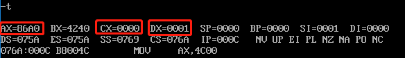
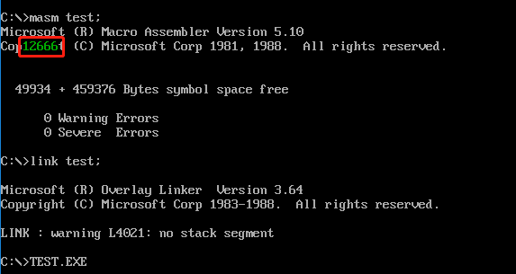

# 实验10 编写子程序


## 显示字符串

### 问题

显示字符串是现实工作中经常要用到的功能，应该编写一个通用的子程序来实现这个功能。提供灵活的调用接口，使调用者可以决定显示的位置（行、列）、内容和颜色。

### 子程序描述

- 名称: `show_str`
- 功能: 在指定的位置，用指定的颜色，显示一个用 `0` 结束的字符串
- 参数: `(dh)=行号`（取值范围 `0~24`），`(dl)=列号`（取值范围 `0~79`），`(cl)=颜色`，`ds:si` 指向字符串的首地址
- 返回: 无
- 应用举例: 在屏幕的 `8` 行 `3` 列，用绿色显示 `data` 段中的字符串

```asm
assume cs:code
data segment
    db 'Welcome to masm!',0
data ends
code segment
start:
    mov dh,8
    mov dl,3
    mov cl,2
    mov ax,data
    mov ds,ax
    mov si,0
    call show_str
    mov ax,4c00h
    int 21h
show_str:
    ...

code ends
end start
```

### 提示

- 子程序的入口参数是屏幕上的行号和列号，注意在子程序内部要将它们转化为显存中的地址，首先要分析一下屏幕上的行列位置和显存地址的对应关系
- 注意保存子程序中用到的相关寄存器
- 这个子程序的内部处理和显存的结构密切相关，但是向外提供了与显存结构无关的接口。通过调用这个子程序，进行字符串的显示时可以不必了解显存的结构，为编程提供了方便。

### 解答

由于需要显示有颜色的字符串，所以使用 `80×25` 彩色模式。每个字符占用 `2` 个字节，低位存储 `ASCII` 码、高位存储属性。屏幕共占用 `4000` 字节，可存储 `2000` 个字符，共 `25` 行，每行 `80` 个字符。

由于写入位置的行号为 `DH` 的内容、列号为 `DL` 的内容，且每行的字节数为 `160`，所以可以使用乘法定位写入位置的起始位置。使用两个 `8` 位寄存器做乘法:

```asm
mov al,160  ; 8 位寄存器乘法，一个存在 AL 中，另一个存在寄存器或内存单元（DH）中
mul dh      ; 定位行的偏移，乘法结果存放在 AX 中
mov bx,ax   ; 以防被下一个乘法覆盖，这里需要保存寄存器 AX 的内容，如 BX
mov al,2
mul dl      ; 定位列的偏移，乘法结果存放在 AX 中
add bx,ax   ; 最终的偏移
```

由于事先不知道 `data` 段中字符串的长度，题目给出字符串的用 `0` 结束。`jcxz` 标号的功能是当寄存器 `CX` 的内容为 `0` 时则跳转到标号执行。所以，我们可以使用寄存器 `CX` 来接收字符串中的内容，并使用 `jcxz` 指令来判断是否到达字符串结尾。

由于不知道循环次数，这里使用 `jmp` 指令配合 `jcxz` 来完成循环功能:

```asm
help:
    mov cl,data:[]  ; 将 data 段字符串依次写入 CL 中
    jcxz 标号       ; 一个退出标号，退出当前 help 子程序
    ...             ; 写入字符及其属性
    ...             ; 相关偏移
    jmp short help  ; 转移实现类似循环的功能
```


```asm
show_str:
    ; 将子程序用到的寄存器内容入栈
    push ax
    push es
    push bx
    push cx
    push dx
    push si
    push di

    ; 寄存器 ES 指向彩色模式段
    mov ax,0B800H
    mov es,ax

    ; 计算偏移
    mov al,160  ; 8 位寄存器乘法，一个存在 AL 中，另一个存在寄存器或内存单元（DH）中
    mul dh      ; 定位行的偏移，乘法结果存放在 AX 中
    mov bx,ax   ; 以防被下一个乘法覆盖，这里需要保存寄存器 AX 的内容，如 BX
    mov al,2
    mul dl      ; 定位列的偏移，乘法结果存放在 AX 中
    add bx,ax   ; 最终的偏移

    ; 将颜色属性存到 AL 中，因为后面的 jcxz 指令会用到 CX
    mov al,cl
help:
    mov cl,ds:[si]      ; 取字符串的字符
    jcxz exit           ; 如果 CX 等于 0 则退出
    mov es:[bx+di],cl   ; 低位写入字符的 ASCII 码
    mov es:[bx+di+1],al ; 高位写入字符的属性
    inc si              ;偏移 1 字节取字符
    add di,2            ; 偏移 2 字节写字符
    jmp short help      ; 转移实现类似循环的功能
exit:
    ; 将子程序用到的寄存器内容出栈
    pop di
    pop si
    pop dx
    pop cx
    pop bx
    pop es
    pop ax
    ret
```


## 解决除法溢出的问题

### 问题

`div` 指令可以做除法。当进行 `8` 位除法的时候，用 `al` 存储结果的商，`ah` 存储结果的余数，进行 `16` 位除法的时候，用 `ax` 存储结果的商，`dx` 存储结果的余数。

如果结果的商大于 `al` 或 `ax` 所能存储的最大值，那么将如何？

比如:

```asm
mov bh,1
mov ax,1000
div bh
```

进行的是 `8` 位除法，结果的商为 `1000`，而 `1000` 在 `al` 中放不下。

又比如:

```asm
mov ax,1000H
mov dx,1
mov bx,1
div bx
```

进行的是 `16` 位除法，结果的商为 `11000H`，而 `11000H` 在 `ax` 中存放不下。

结果的商过大，超出了寄存器所能存储的范围，将引发 `CPU` 的一个内部错误，这个错误被称为: 除法溢出。

### 子程序描述

- 名称: `divdw`
- 功能: 进行不会产生溢出的除法运算，被除数为 `dword` 型，除数为 `word` 型，结果为 `dword` 型。
- 参数: 
  - `(ax)=dword` 型数据的低 `16` 位
  - `(dx)=dword` 型数据的高 `16` 位
  - `(cx)=除数`
- 返回:
  -  `(dx)=结果的高16位`，`(ax)=结果的低16位`
  - `(cx)=余数`
应用举例: 计算 `1000000/10`（`F4240H/0AH`）

```asm
mov ax,4240H
mov dx,000FH
mov cx,0AH
call divdw
```

- 结果: `(dx)=0001H`，`(ax)=86A0H`，`(cx)=0`

### 提示

给出一个公式:

- `X`: 被除数，范围: `[0, FFFFFFFF]`
- `N`: 除数，范围: `[0, FFFF]`
- `H`: `X` 高 `16` 位，范围: `[0, FFFF]`
- `L`: `X` 低 `16` 位，范围: `[0, FFFF]`
- `int()`: 描述性运算符，取商，比如，`int(38/10)=3`
- `rem()`: 描述性运算符，取余数，比如，`rem(38/10)=8`
- 公式: `X/N=int(H/N)*65536+⌊rem(H/N)*65536+L⌋/N`

这个公式将可能产生溢出的除法运算: `X/N`，转变为多个不会产生溢出的除法运算。公式中，等号右边的所有除法运算都可以用 `div` 指令来做，不会导致除法溢出。

### 解答

根据手动计算的过程可以得到: 左边除法运算的商由两部分组成，即右边等式加号的左右两部分。第一部分的商乘以 `65536` 相当于将其存放在结果的高 `16` 位，同理，加号右边部分乘以 `65536` 相当于将余数放到高 `16` 位。

`H/N` 表示被除数 `X` 的高 `16` 位除法。因为除数 `N` 是 `16` 位，所以被除数由高 `16` 位 `DX` 和 低 `16` 位 `AX` 组成。这里，需将 `DX` 设置为零:

```asm
mov bx,ax   ; 由于后面除法会用到 AX，将其内容暂存到寄存器 BX 中
mov ax,dx   ; 针对 X 高 16 位的除法，将被除数 X 的高 16 位存放在 AX 中
mov dx,0    ; 除法 H/N 中高 16 位设置为零
div cx      ; 执行除法 H/N，此时结果的商存放在 AX 中、余数存放在 DX 中
```

此时，除法结果中的高位为最终结果的商的高 `16` 位。由于后面还有一个除法，会继续使用寄存器 `AX`，所以将其值存放到其他寄存器:

```asm
mov si,ax ; H/N 运算结果的商
```

由前面的叙述可知，在第二个除法中，由于除数为 `16` 位，所以被除数为 `32` 位。且，被除数的高 `16` 位由 `H/N` 除法运算的余数组成，低 `16` 位由 `L` 组成:

```asm
mov dx,dx   ; 这里表示将 H/N 的余数 (DX) 放到下一次除法的高 16 位处 (DX)
mov ax,bx   ; 将被除数低 16 位的内容放到 AX 中
div cx      ; 执行除法 ⌊rem(H/N)*65536+L⌋/N，此时结果的商存放在 AX 中、余数存放在 DX 中
```

题目要求，`(dx)=结果的高16位`、`(ax)=结果的低16位`、`(cx)=余数`。高 `16` 位前面存放寄存器 `SI` 中了，低 `16` 位存放在 `AX` 中，余数存放在 `DX` 中:

```asm
mov cx,dx   ; 余数
mov dx,si   ; 高 16 位
mov ax,ax   ; 低 16 位
```

```asm
divdw:
    mov bx,ax   ; 由于后面除法会用到 AX，将其内容暂存到寄存器 BX 中

    mov ax,dx   ; 针对 X 高 16 位的除法，将被除数 X 的高 16 位存放在 AX 中
    mov dx,0    ; 除法 H/N 中高 16 位设置为零
    div cx      ; 执行除法 H/N，此时结果的商存放在 AX 中、余数存放在 DX 中

    mov si,ax   ; H/N 运算结果的商

    mov ax,bx   ; 将被除数低 16 位的内容放到 AX 中
    div cx      ; 执行除法 ⌊rem(H/N)*65536+L⌋/N，此时结果的商存放在 AX 中、余数存放在 DX 中

    mov cx,dx   ; 余数
    mov dx,si   ; 高 16 位
    ret
```



## 数值显示

### 问题

编程，将 `data` 段中的数据以十进制的形式显示出来。

```
data segment
dw 123,12666,1,8,3,38
data ends
```

这些数据在内存中都是二进制信息，标记了数值的大小。要把它们显示到屏幕上，需要进行信息的转化。比如，数值 `12666`，在机器中存储为二进制信息: `0011000101111010B`（`317AH`），计算机可以理解它。

由于显卡遵循的是 `ASCII` 编码，它在机器中应以 `ASCII` 码的形式存储为:

`31H`、`32H`、`36H`、`36H`、`36H`（字符 `0~9` 对应的 `ASCII` 码为 `30H~39H`）。

要将数据用十进制形式显示到屏幕上，要进行两步工作:
- 将用二进制信息存储的数据转变为十进制形式的字符串
- 显示十进制形式的字符串

第二步在本次实验的第一个子程序中已经实现，在这里只要调用一下 `show_str` 即可。

将二进制信息转变为十进制形式的字符串应该为它编写一个通用的子程序。

### 子程序描述

- 名称: `dtoc`
- 功能: 将 `word` 型数据转变为表示十进制数的字符串，字符串以 `0` 为结尾符。
- 参数:
  - `(ax)=word型数据`
  - `ds:si` 指向字符串的首地址
- 返回: 无
- 应用举例: 编程，将数据 `12666` 以十进制的形式在屏幕的 `8` 行 `3` 列，用绿色显示出来。在显示时调用本次实验中的第一个子程序 `show_str`。

```asm
assume cs:code
data segment
    db 10 dup (0)
data ends

code segment
start:
    mov ax,12666
    mov bx,data
    mov ds,bx
    mov si,0
    call dtoc
    mov dh,8
    mov dl,3
    mov cl,2
    call show_str
    ...
code ends
end start
```

要通过数字 `12666` 得到其字符串形式，首先要得到数字的每一位，然后将其转换成 `16` 进制的 `ASCII` 码值。第一步，可通过除 `10` 取余的操作从低到高依次得到数字的每一位，第二步，将得到的每一位加上 `30H` 即可得到对应的 `ASCII` 码值。

如何判断除 `10` 操作是否继续进行？ 如果商为 `0`，则不继续进行除 `10` 操作，而当前余数为数字的最高位。解决办法是使用寄存器 `CX` 来存储商，再借助 `jcxz` 指令来实现相关功能。这里，除数 `10` 使用 `BX` 存储，则被除数低 `16` 位默认放在 `AX` 中。

```asm
dtoc:
	push ax 
	push bx 
	push cx 
	push dx
	push si
	push di         ; 将子程序用到的寄存器内容入栈

	mov di,0        ; 计数器清零
	mov bx,10       ; BX 存放余数

div_call:	
	mov dx,0        ; 寄存器 DX 清零
	div bx          ; 被除数在 AX 中，默认 16 位除法的商存放在 AX 中、余数存放在 DX 中

	add dx,30h      ; 余数加上 30H 转换为对应 ASCII 码值
	push dx         ; 入栈
	inc di          ; 计数
	mov cx,ax       ; 判断商是否为零
	jcxz ok
	jmp short div_call	;如果商不为零则继续执行除法运算

ok:
	mov cx,di       ; DI 记录了栈中数据个数，将其赋值给 CX 作为后续循环次数
	
assign:
	pop ax          ; 栈中数据依次出栈
	mov ds:[si],al	; 写入数据段，每次写入一个字节
	inc si          ; 偏移 1 个字节写入下个元素
	loop assign 	; 循环赋值

	pop di 
	pop si 
	pop dx 
	pop cx 
	pop bx
	pop ax          ; 将子程序用到的寄存器内容出栈
	ret             ; 子程序返回
```

