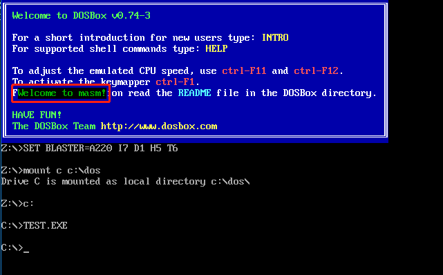

# 实验10 编写子程序


## 显示字符串

### 问题

显示字符串是现实工作中经常要用到的功能，应该编写一个通用的子程序来实现这个功能。提供灵活的调用接口，使调用者可以决定显示的位置（行、列）、内容和颜色。

### 子程序描述
- 名称: `show_str`
- 功能: 在指定的位置，用指定的颜色，显示一个用 `0` 结束的字符串
- 参数: `(dh)=行号`（取值范围 `0~24`），`(dl)=列号`（取值范围 `0~79`），`(cl)=颜色`，`ds:si` 指向字符串的首地址
- 返回: 无
- 应用举例: 在屏幕的 `8` 行 `3` 列，用绿色显示 `data` 段中的字符串

```asm
assume cs:code
data segment
    db 'Welcome to masm!',0
data ends
code segment
start:
    mov dh,8
    mov dl,3
    mov cl,2
    mov ax,data
    mov ds,ax
    mov si,0
    call show_str
    mov ax,4c00h
    int 21h
show_str:
    ...

code ends
end start
```

### 提示
- 子程序的入口参数是屏幕上的行号和列号，注意在子程序内部要将它们转化为显存中的地址，首先要分析一下屏幕上的行列位置和显存地址的对应关系
- 注意保存子程序中用到的相关寄存器
- 这个子程序的内部处理和显存的结构密切相关，但是向外提供了与显存结构无关的接口。通过调用这个子程序，进行字符串的显示时可以不必了解显存的结构，为编程提供了方便。

由于需要显示有颜色的字符串，所以使用 `80×25` 彩色模式。每个字符占用 `2` 个字节，低位存储 `ASCII` 码、高位存储属性。屏幕共占用 `4000` 字节，可存储 `2000` 个字符，共 `25` 行，每行 `80` 个字符。

由于写入位置的行号为 `DH` 的内容、列号为 `DL` 的内容，且每行的字节数为 `160`，所以可以使用乘法定位写入位置的起始位置。使用两个 `8` 位寄存器做乘法:

```asm
mov al,160  ; 8 位寄存器乘法，一个存在 AL 中，另一个存在寄存器或内存单元（DH）中
mul dh      ; 定位行的偏移，乘法结果存放在 AX 中
mov bx,ax   ; 以防被下一个乘法覆盖，这里需要保存寄存器 AX 的内容，如 BX
mov al,2
mul dl      ; 定位列的偏移，乘法结果存放在 AX 中
add bx,ax   ; 最终的偏移
```

由于事先不知道 `data` 段中字符串的长度，题目给出字符串的用 `0` 结束。`jcxz` 标号的功能是当寄存器 `CX` 的内容为 `0` 时则跳转到标号执行。所以，我们可以使用寄存器 `CX` 来接收字符串中的内容，并使用 `jcxz` 指令来判断是否到达字符串结尾。

由于不知道循环次数，这里使用 `jmp` 指令配合 `jcxz` 来完成循环功能:

```asm
help:
    mov cl,data:[]  ; 将 data 段字符串依次写入 CL 中
    jcxz 标号       ; 一个退出标号，退出当前 help 子程序
    ...             ; 写入字符及其属性
    ...             ; 相关偏移
    jmp short help  ; 转移实现类似循环的功能
```


```asm
show_str:
    ; 将子程序用到的寄存器内容入栈
    push ax
    push es
    push bx
    push cx
    push dx
    push si
    push di

    ; 寄存器 ES 指向彩色模式段
    mov ax,0B800H
    mov es,ax

    ; 计算偏移
    mov al,160  ; 8 位寄存器乘法，一个存在 AL 中，另一个存在寄存器或内存单元（DH）中
    mul dh      ; 定位行的偏移，乘法结果存放在 AX 中
    mov bx,ax   ; 以防被下一个乘法覆盖，这里需要保存寄存器 AX 的内容，如 BX
    mov al,2
    mul dl      ; 定位列的偏移，乘法结果存放在 AX 中
    add bx,ax   ; 最终的偏移

    ; 将颜色属性存到 AL 中，因为后面的 jcxz 指令会用到 CX
    mov al,cl
help:
    mov cl,ds:[si]      ; 取字符串的字符
    jcxz exit           ; 如果 CX 等于 0 则退出
    mov es:[bx+di],cl   ; 低位写入字符的 ASCII 码
    mov es:[bx+di+1],al ; 高位写入字符的属性
    inc si              ;偏移 1 字节取字符
    add di,2            ; 偏移 2 字节写字符
    jmp short help      ; 转移实现类似循环的功能
exit:
    ; 将子程序用到的寄存器内容出栈
    pop di
    pop si
    pop dx
    pop cx
    pop bx
    pop es
    pop ax
    ret
```



