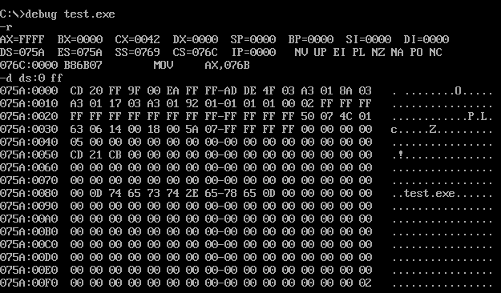
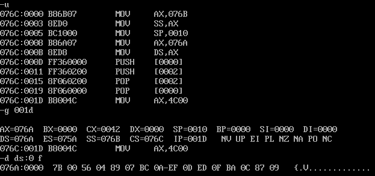
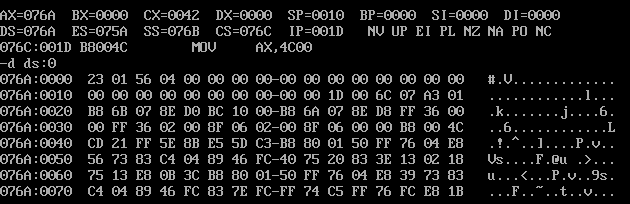
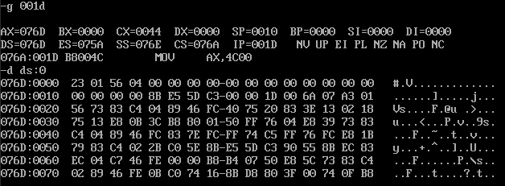

# 实验5 编写、调试具有多个段的程序

## 将下面的程序编译、连接，用 `Debug` 加载、跟踪，然后回答问题

```asm
assume cs:code,ds:data,ss:stack
data segment
    dw 0123,0456h,0789h,0abch,0defh,0fedh,0cbah,0987h
data ends
stack segment
    dw 0,0,0,0,0,0,0,0
stack ends
code segment
start:
    mov ax,stack
    mov ss,ax
    mov sp,16
    
    mov ax,data
    mov ds,ax
    
    push ds:[0]
    push ds:[2]
    pop ds:[2]
    pop ds:[0]
    
    mov ax,4c00h
    int 21h
code ends
end start
```



在程序刚载入内存时，由于还没有执行设定数据段地址的指令（`mov ds,data`），`DS` 段地址默认指向程序起始位置（包括 `PSP` 数据区），此时 `DS:0~DS:FF` 为 `PSP` 数据区（占`256`个字节），`DS:100` 开始为数据段、栈段、代码段内容。



在执行了 `mov ds,data` 指令后，数据段被手工设定为 `DS:0~D:F` 为数据段（`DS` 段地址已经被更改）。

`CPU` 执行程序，程序返回前，`data` 段中的数据为 `23 01 56 04 89 07 BC 0A EF 0D ED 0F BA 0C 87 09`。

`CPU` 执行程序，程序返回前，`CS=076C`、`SS=076B`、`DS=076A`

设程序加载后，`code` 段的段地址为 `X`，则 `data` 段的段地址为段地址为 `X-2`，`stack` 段地址为段地址为 `X-1`。

## 将下面的程序编译、连接，用 `Debug` 加载、跟踪，然后回答问题

```asm
assume cs:code,ds:data,ss:stack
data segment
    dw 0123h,0456h
data ends
stack segment
    dw 0,0
stack ends
code segment
start:
    mov ax,stack
    mov ss,ax
    mov sp,16
    
    mov ax,data
    mov ds,ax
    
    push ds:[0]
    push ds:[2]
    pop ds:[2]
    pop ds:[0]
    
    mov ax,4c00h
    int 21h
code ends
end start
```



`CPU` 执行程序，程序返回前，`data` 段中的数据为 `23 01 56 04 00 00 00 00 00 00 00 00 00 00 00 00`，数据段和栈段在程序加载后实际占用空间都是以 `16` 个字节为单位的。如果不足，以 `0` 补全。

`CPU` 执行程序，程序返回前，`CS=076C`、`SS=076B`、`DS=076A`。

设程序加载后，`code` 段的段地址为 `X`，则 `data` 段的段地址为段地址为 `X-2`，`stack` 段地址为段地址为 `X-1`。

如果段中的数据占N个字节，则程序加载后，该段实际占有的空间为 $\lceil N/16\rceil \cdot 16$

如果 `N` 小于 `16`，那么实际占用 `16` 个字节；如果 `N` 大于 `16`，那么实际占用 `(N/16取整数+1)*16` 个字节。即如果段中的数据占 `N` 个字节，则程序加载后，该段实际占有的空间为 $\lceil N/16\rceil \cdot 16$。

## 将下面的程序编译、连接，用 `Debug` 加载、跟踪，然后回答问题

```asm
assume cs:code,ds:data,ss:stack
 
code segment
start:
    mov ax,stack
    mov ss,ax
    mov sp,16
    
    mov ax,data
    mov ds,ax
    
    push ds:[0]
    push ds:[2]
    pop ds:[2]
    pop ds:[0]
    
    mov ax,4c00h
    int 21h
code ends
data segment
    dw 0123h,0456h
data ends
stack segment
    dw 0,0
stack ends
end start
```

与前面所不同的是将数据段和栈段放到了代码段的后面。



`CPU` 执行程序，程序返回前，`data` 段中的数据为 `23 01 56 04 00 00 00 00 00 00 00 00 00 00 00 00`

`CPU` 执行程序，程序返回前，`CS=076A`、`SS=076E`、`DS=076D`。

设程序加载后，`code` 段的段地址为 `X`，则 `data` 段的段地址为段地址为 `X+3`，`stack` 段地址为段地址为 `X+4`。

## 如果将前面题中的最后一条伪指令 `end start` 改为 `end`（也就是说，不指明程序的入口），则哪个程序仍然可以正确执行？请说明原因

在程序设计中，我们用伪指令 `end` 描述了程序的结束和程序的入口。在编译链接后，由 `end start` 指明的程序入口，被转化为一个入口地址，我们可以发现在程序中设置了 `start` 和 `end start` 后 程序执行时会从 `start` 位置开始，到 `end start` 位置结束。

如果不设 `end start`，只设置 `end`。那么此时程序会默认从 `PSP` 数据区后开始执行（即使设置了`start`，程序也不会从 `start` 位置开始执行）。如果要保证程序正确执行，那么在 `PSP` 数据区之后必须为代码段才行。由 `(1)`、`(2)`、`(3)` 三个程序可知只有程序 `(3)` 代码段在开头，故最后一条伪指令 `end start` 改为 `end` 后，程序 `(3)` 仍然可以正确执行，程序 `(1)`、`(2)` 虽然也能执行，但它们的开头是数据段，将数据段中数据视作代码来执行有可能会导致混乱。因此，若代码段不在程序的开头，就应当指明入口防止程序执行时逻辑上发生错误。

## 程序如下、编写 `code` 段中的代码，将 `a` 段和 `b` 段中的数据依次相加，将结果存到 `c` 段中

```asm
assume cs:code
a segment
    db 1,2,3,4,5,6,7,8  ; 按字节存放
a ends
b segment
    db 1,2,3,4,5,6,7,8
b ends
c segment
    db 0,0,0,0,0,0,0,0
c segment
code segment
start:
    ___________
code ends
end start
```

`a` 段、`b` 段和 `c` 段的数据都是按字节存放的，所以在使用寄存器转移数据时一定要使用 `8` 位寄存器而不是 `16` 位寄存器。

使用 `DS` 存储 `a` 段地址，`b` 段地址可以直接使用 `DS + 16` 表示（`a` 段不足 `16` 个字节用 `0` 补上后占 `16` 个字节） `ES` 存储 `c` 段地址，每次循环将 `a` 段和 `b` 段的一个字节相加后存入 `c` 段中即可。

```asm
assume cs:code
a segment
    db 1,2,3,4,5,6,7,8
a ends

b segment
    db 1,2,3,4,5,6,7,8
b ends

c segment
    db 0,0,0,0,0,0,0,0
c ends

code segment
start:
      mov ax,a
      mov ds,ax    ; ds 存放 a 段地址
      mov ax,c
      mov es,ax    ; es 存放 c 段地址
      mov bx,0
      mov cx,8     ; 对字进行 8 次循环操作
s0:
      mov al,[bx]
      add al,[bx+16]    ; a 段不足 16 个字节用 0 补上后占 16 个字节
      mov es:[bx],al    ; a + 16 后即为 b 段地址
      inc bx
      loop s0
      mov ax,4c00h
      int 21h
code ends
end start
```

## 程序如下，编写 `code` 段中的代码，用 `push` 命令将 `a` 段中的前 `8` 个字型数据，逆序存储到 `b` 段中

```asm
assume cs:code
a segment
    dw 1,2,3,4,5,6,7,8,9,0ah,0bh,0ch,0dh,0eh,0fh,0ffh   ; 按字存储
a ends
b segment
    dw 0,0,0,0,0,0,0,0
b ends
code segment
start:
    __________
code ends
end start
```

这里应当 `a` 段为数据段、`b` 段为栈段才能使用 `push` 指令将 `a` 段的数据压入 `b` 段中，循环 `8` 次即可。

```asm
assume cs:code

a segment
  dw 1,2,3,4,5,6,7,8,9,0ah,0bh,0ch,0dh,0eh,0fh,0ffh
a ends

b segment
  dw 0,0,0,0,0,0,0,0
b ends

code segment
start:
      mov ax,a
      mov ds,ax    ; DS 存放 a 段地址
      mov ax,b
      mov ss,ax    ; SS 存放 b 段地址（栈段）
      mov sp,10h
      mov bx,0    
      mov cx,8
s0:
      push [bx]    ; a 段数据压入 b 段
      inc bx       ; 由于字占 16 位，一个内存单元占 8 位
      inc bx       ; 故每次循环 + 2 才能指到下一个字
      loop s0
      mov ax,4c00h
      int 21h
code ends
end start
```