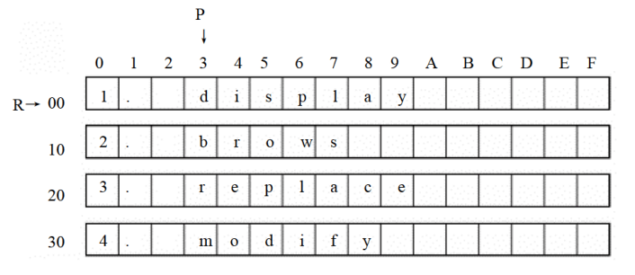
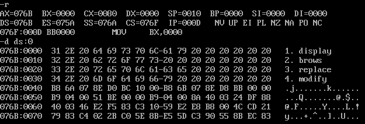
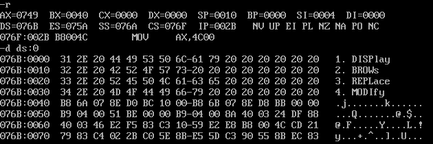

# 实验6 实践课程中的程序

## 编程，将 `datasg` 段中每个单词的前 `4` 个字母改为大写字母

```asm
assume cs:codesg,ss:stacksg,ds:datasg

stacksg segment
    dw 0,0,0,0,0,0,0,0
stacksg ends

datasg segment
    db '1. display      '
    db '2. brows        '
    db '3. replace      '
    db '4. modify       '
datasg ends

codesg segment
start:

codesg ends
end start
```

`datasg` 中数据结构如图:



`datasg` 中定义了 `4` 个字符串，每个字符串长度均为 `16` 字节，要求修改每个单词前 `4` 个字母，则要修改每个字符串的 `[3]~[6]`。

用一个二重循环解决问题，第一重循环用来循环字符串，第二重用来修改第一行字符串的 `[3]~[6]`，共 `4*4` 次循环。

运用一个栈保存第一次循环数，用将数据与 `11011111b` 相与将其变为大写。

```asm
assume cs:codesg,ss:stacksg,ds:datasg

stacksg segment
    dw 0,0,0,0,0,0,0,0
stacksg ends

datasg segment
    db '1. display      '
    db '2. brows        '
    db '3. replace      '
    db '4. modify       '
datasg ends

codesg segment
start:
    mov ax,stacksg
    mov ss,ax
    mov sp,16
    mov ax,datasg
    mov ds,ax
    mov bx,0
    mov cx,4
s0:
    push cx
    mov si,0
    mov cx,4
s:
    mov al,[bx+si+3]
    and al,11011111b
    mov [bx+si+3],al
    inc si
    loop s

    add bx,16
    pop cx
    loop s0

    mov ax,4c00H
    int 21H

codesg ends
end start
```



