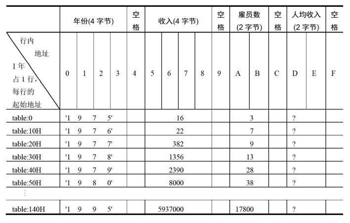

# 实验7 寻址方式在结构化数据访问中的应用

`Power idea` 公司从 `1975` 年成立一直到 `1995` 年的基本情况如下。

|年份|收入（千美元）|雇员（人）|人均收入（千美元）|
|-|-|-|-|
|1975|16|3|?|
|1976|22|7|?|
|1977|382|9|?|
|1978|1356|13|?|
|1979|2390|28|?|
|1980|8000|38|?|
|1995|5937000|17800|?|

下面的程序中，已经定义好了这些数据:

```asm
assume cs:codesg

data segment
    db '1975','1976','1977','1978','1979','1980','1981','1982','1983'
    db '1984','1985','1986','1987','1988','1989','1990','1991','1992'
    db '1993','1994','1995'
    ; 以上是表示 21 年的 21 个字符串
    
    dd 16,22,382,1356,2390,8000,16000,24486,50065,97479,140417,197514
    dd 345980,590827,803530,1183000,1843000,2759000,3753000,4649000,5937000
    ; 以上是表示 21 年公司总收入的 21 个 dword 型数据
    
    dw 3,7,9,13,28,38,130,220,476,778,1001,1442,2258,2793,4037,5635,8226
    dw 11542,14430,15257,17800
    ; 以上是表示 21 年公司雇员人数的 21 个 word 型数据    
data ends

table segment
    db 21 dup ('year summ ne ?? ')
table ends
```

## 编程，将 `data` 段中的数据按如下格式写入到 `table` 段中，并计算 `21` 年中的人均收入（取整），结果也按照下面的格式保存在 `table` 段中



提示，可将 `data` 段中的数据看成是多个数组，而将 `table` 中的数据看成是一个结构型数据的数组，每个结构型数据中包含多个数项。可用 `bx` 定位每个结构型数据，用 `idata` 定位数据项，用 `si` 定位数组项中的每个元素，对于 `table` 中的数据的访问可采用 `[bx].idata` 和 `[bx].idata[si]` 的寻址方式。

```asm
assume cs:codesg

data segment
    db '1975','1976','1977','1978','1979','1980','1981','1982','1983'
    db '1984','1985','1986','1987','1988','1989','1990','1991','1992'
    db '1993','1994','1995'
    ; 以上是表示 21 年的 21 个字符串
    
    dd 16,22,382,1356,2390,8000,16000,24486,50065,97479,140417,197514
    dd 345980,590827,803530,1183000,1843000,2759000,3753000,4649000,5937000
    ; 以上是表示 21 年公司总收入的 21 个 dword 型数据
    
    dw 3,7,9,13,28,38,130,220,476,778,1001,1442,2258,2793,4037,5635,8226
    dw 11542,14430,15257,17800
    ; 以上是表示 21 年公司雇员人数的 21 个 word 型数据    
data ends

table segment
    db 21 dup ('year summ ne ?? ')
table ends

codesg segment
start: ; 设置段地址
    mov ax,data
    mov es,ax
    mov ax,table
    mov ds,ax
            
    mov bx,0 ; table 数据的偏移地址，决定从哪一行开始
    mov bp,0 ; 年份，收入（4 字节）数据的偏移地址，每次增加 4
    mov si,0 ; 雇员数（2 字节）数据的偏移地址，每次增加 2
    mov cx,21 ; 总共 21 年，循环 21 次
    
a:
    ; 将年份（4 字节）数据复制到 year 上
    mov ax,es:[bp+0]
    mov ds:[bx+0],ax
    mov ax,es:[bp+2]
    mov ds:[bx+2],ax
    
    ; 将收入（4字节）数据复制到 summ 上
    mov ax,es:[bp+54H]
    mov ds:[bx+5],ax
    mov ax,es:[bp+56H]
    mov ds:[bx+7],ax
    
    ; 将雇员数（2 字节）数据复制到 ne 上
    mov ax,es:[si+0A8H]
    mov ds:[bx+10],ax
    
    ; 将人均收入（2 字节）数据复制到 ?? 上
    mov ax,ds:[bx+5]
    mov dx,ds:[bx+7]
    div word ptr ds:[bx+10]
    mov ds:[bx+13],ax

    ; 累加操作
    add si,2
    add bp,4
    add bx,16

    loop a
    mov ax,4C00H
    int 21H
codesg ends
end start
```