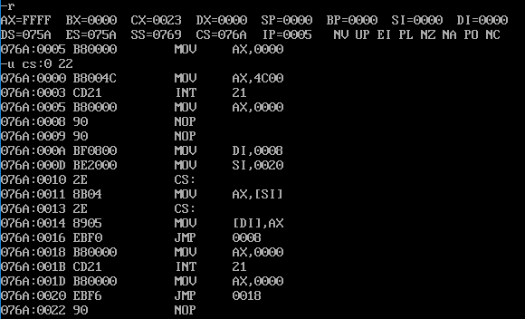

# 实验8 分析一个奇怪的程序

## 分析下面的程序，这个程序可以正确返回吗？为什么是这种结果？

```asm
assume cs:codesg
codesg segment
    mov ax,4c00h
    int 21h
start:
    mov ax,0
s:
    nop
    nop
    mov di,offset s
    mov si,offset s2
    mov ax,cs:[si]
    mov cs:[di],ax
s0:
    jmp short s
s1:
    mov ax,0
    int 21h
    mov ax,0
s2:
    jmp short s1
    nop
codesg ends
end start
```



分析:

程序从 `start` 处开始，`mov ax,0` 执行后使得 `(ax)=0`

`CPU` 遇到 `nop` 指令什么也不做，占用一个字节

`mov di,offset s`，将 `s` 的偏移地址存到 `di` 寄存器中，`mov si,offset s2`，将 `s2` 的偏移地址存到 `si` 中。

`mov ax,cs:[si]` 将 `cs:[si]` 处的字形数据，即 `s2` 的偏移地址存到 `ax`，`mov cs:[di],ax` 将 `ax` 所存储的字形数据，即 `s2` 的偏移地址存到 `s` 处。

`s2` 处的第一个指令是 `jmp short s1` 短转移指令，机器码为 `EB F6`，`F6` 是位移的范围，从 `jmp short s1` 下一条指令的开始位置跳转到 `s1` 处，向前跳转 `10` 个字节，`10` 的二进制为 `0000 1010`，取其补码，即按位取反再加 `1` 后为 `1111 0110`，`16` 进制为 `F6H` 也就是说，该两个字节被复制到两个 `nop` 处。

`jmp short s` 跳转到 `s` 处，会执行 `EB F6`，向前跳转 `10` 个字节，会执行程序返回:

```asm
mov ax,4c00h
int 21h
```