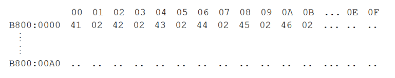
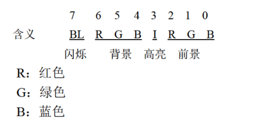

# 实验9 根据材料编程

## 编程: 在屏幕中间分别显示绿色、绿底红色、白底蓝色的字符串 `welcome to masm!`

`80x25` 彩色字符模式显示缓冲区的结构:

内存地址空间中，`B8000H~BFFFFH` 共 `32KB` 的空间，为 `80×25` 彩色字符模式的显示缓冲区。向这个地址空间写入数据，写入的内容将立即出现在显示器上。

在 `80x25` 彩色字符模式下，显示器可以显示 `25` 行，每行 `80` 个字符，每个字符可以有 `256` 种属性（背景色、前景色、闪烁、高亮等组合信息）。

这样，一个字符在显示缓冲区中就要占两个字节，分别存放字符的 `ASCII` 码和属性。`80x25` 模式下，一屏的内容在显示缓冲区中共占 `4000` 个字节。

显示缓冲区分为 `8` 页，每页 `4KB`，显示器可以显示任意一页的内容。一般情况下，显示第 `0` 页的内容。

在一页显示缓冲区中:
- 偏移 `000~09F` 对应显示器上的第 `1` 行（`80` 个字符占 `160` 个字节）
- 偏移 `0A0~13F` 对应显示器上的第 `2` 行
- 偏移 `140~1DF` 对应显示器上的第 `3` 行
- 依此类推，可知，偏移 `F00~F9F` 对应显示器上的第 `25` 行

在一行中，一个字符占两个字节的存储空间，低位字节存储字符的 `ASCII` 码，高位字节存储字符的属性。一行共有 `80` 个字符，占 `160` 个字节。

即在一行中:
- `00~01` 单元对应显示器上的第 `1` 列
- `02~03` 单元对应显示器上的第 `2` 列
- `04~05` 单元对应显示器上的第 `3` 列
依此类推，可知，`9E~9F` 单元对应显示器上的第 `80` 列

例: 在显示器的 `0` 行 `0` 列显示黑底绿色的字符串 `ABCDEF`，`A` 的 `ASCII` 码值为 `41H`，`02H` 表示黑底绿色，显示缓冲区里的内容为:



在显示缓冲区中，偶地址存放字符，奇地址存放字符的颜色属性。

一个在屏幕上显示的字符，具有前景（字符色）和背景（底色）两种颜色，字符还可以以高亮度和闪烁的方式显示。前景色、背景色、闪烁、高亮等信息被记录在属性字节中:



可以按位设置属性字节，从而配出各种不同的前景色和背景色。比如:
- 红底绿字，属性字节为: `01000010B`
- 红底闪烁绿字，属性字节为: `11000010B`
- 红底高亮绿字，属性字节为: `01001010B`
- 黑底白字，属性字节为: `00000111B`
- 白底蓝字，属性字节为: `01110001B`

```asm
assume cs:code, ds:data, ss:stack
data segment
       ;0123456789ABCDRF
    db 'welcome to masm!' ; 16 字节
    db 00000010B
    db 00100100B
    db 01110001B
data ends

stack segment
    db 16 dup (0)
stack ends

code segment
start:
    mov ax,data
    mov ds,ax

    mov ax,stack
    mov ss,ax
    mov sp,0

    mov ax,0B800H
    mov es,ax

    mov bx,0
    mov dx,0
    mov di,16
    mov si,160*12+32*2 ; 将字符输出到屏幕中央
    mov cx,3

col:
    mov dh,ds:[di] ; 高位放属性
    push cx
    mov cx,16

row:
    mov dl,ds:[bx] ; 低位放 ASCII 码
    mov es:[si],dx ; 放入缓冲区
    add si,2
    inc bx
    loop row

    pop cx
    inc di
    add si,80h ; 移动到下一行
    sub bx,bx ; 字符串从头开始
    loop col

    mov ax,4c00h
    int 21h
code ends
end start
```