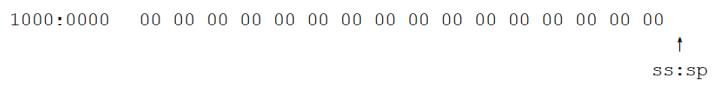
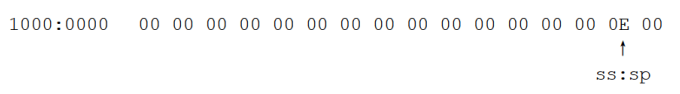
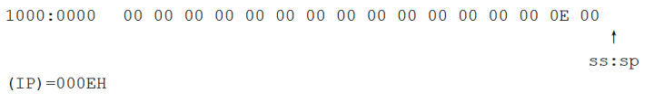

# `CALL` 和 `RET` 指令

`call` 和 `ret` 指令都是转移指令，它们都修改 `IP`，或同时修改 `CS` 和 `IP`。它们经常被共同用来实现子程序的设计。

## `ret` 和 `retf`

- `ret` 指令用栈中的数据，修改 `IP` 的内容，从而实现近转移
- `retf` 指令用栈中的数据，修改 `CS` 和 `IP` 的内容，从而实现远转移

`CPU` 执行 `ret` 指令时，进行下面两步操作:
- `(IP)=((ss)*16+(sp))`
- `(sp)=(sp)+2`
`CPU` 执行 `retf` 指令时，进行下面 `4` 步操作:
- `(IP)=((ss)*16+(sp))`
- `(sp)=(sp)+2`
- `(CS)=((ss)*16+(sp))`
- `(sp)=(sp)+2`

可以看出，如果我们用汇编语法来解释 `ret` 和 `retf` 指令，则:
- `CPU` 执行 `ret` 指令时，相当于进行:
  - `pop IP`
`CPU` 执行 `retf` 指令时，相当于进行:
  - `pop IP`
  - `pop CS`

下面的程序中，`ret` 指令执行后，`(IP)=0`，`CS:IP` 指向代码段的第一条指令。

```asm
assume cs:code
stack segment
    db 16 dup (0)
stack:ends
code segment
mov ax,4c00h
int 21h
start:
    mov ax,stack
    mov ss,ax
    mov sp,16
    mov ax,0
    push ax
    mov bx,0
    ret
code ends
end start
```

下面的程序中，`retf` 指令执行后，`CS:IP` 指向代码段的第一条指令。

```asm
assume cs:code
stack segment
    db 16 dup (0)
stack ends
code segment
    mov ax,4c00h
    int 21h
start:
    mov ax,stack
    mov ss,ax
    mov sp,16
    mov ax,0
    push cs
    push ax
    mov bx,0
    retf
code ends
end start
```

## `call` 指令

`CPU` 执行 `call` 指令时，进行两步操作:
- 将当前的 `IP` 或 `CS` 和 `IP` 压入栈中
- 转移

`call` 指令不能实现短转移，除此之外，`call` 指令实现转移的方法和 `jmp` 指令的原理相同。

## 依据位移进行转移的 `call` 指令

`call 标号`（将当前的 `IP` 压栈后，转到标号处执行指令）

`CPU` 执行此种格式的 `call` 指令时，进行如下的操作:
- `(sp)=(sp)-2`
- `((ss)*16+(sp))=(IP)`
- `(IP)=(IP)+16位位移`

- `16位位移=标号处的地址-call指令后的第一个字节的地址`
- `16位位移` 的范围为 `-32768~32767`，用补码表示
- `16位位移` 由编译程序在编译时算出

`CPU` 执行 `call 标号` 时，相当于进行:

```asm
push IP
jmp near ptr 标号
```

## 转移的目的地址在指令中的 `call` 指令

上面的 `call` 指令其对应的机器指令中并没有转移的目的地址，而是相对于当前 `IP` 的转移位移。

`call far ptr 标号` 实现的是段间转移。`CPU` 执行此种格式的 `call` 指令时，进行如下的操作:
- `(sp)=(sp)-2`
- `((ss)*16+(sp))=(CS)`
- `(sp)=(sp)-2`
- `((ss)*16+(sp))=(IP)`
- `(CS)=标号所在段的段地址`
- `(IP)=标号在段中的偏移地址`

`CPU` 执行 `call far ptr 标号` 时，相当于进行:

```asm
push CS
push IP
jmp far ptr 标号
```

## 转移地址在寄存器中的 `call` 指令

指令格式: `call 16位reg`
功能:
- `(sp)=(sp)-2`
- `((ss)*16+(sp))=(IP)`
- `(IP) =(16位reg)`

相当于进行:

```asm
push IP
jmp 16位reg
```

## 转移地址在内存中的 `call` 指令

转移地址在内存中的 `call` 指令有两种格式:

- `call word ptr 内存单元地址`

相当于进行:

```asm
push IP
jmp word ptr 内存单元地址
```

比如，下面的指令:

```asm
mov sp,10h
mov ax,0123h
mov ds:[0],ax
call word ptr ds:[0]
```

执行后，`(IP)=0123H`，`(sp)=0EH`。

- `call dword ptr 内存单元地址`

CPU 执行 `call dword ptr 内存单元地址` 时，相当于进行:

```asm
push CS
push IP
jmp dword ptr 内存单元地址
```

比如，下面的指令:

```asm
mov sp,10h
mov ax,0123h
mov ds:[0],ax
mov word ptr ds:[2],0
call dword ptr ds:[0]
```

执行后，`(CS)=0`，`(IP)=0123H`，`(sp)=0CH`。

## `call` 和 `ret` 的配合使用

```asm
assume cs:code
code segment
start:
    mov ax,1
    mov cx,3
    call s
    mov bx,ax ; (bx)=?
    mov ax,4c00h
    int 21h
s:
    add ax,ax
    loop s
    ret
code ends
end start
```

- `CPU` 将 `call s` 指令的机器码读入，`IP` 指向了 `call s` 后的指令 `mov bx,ax`，然后 `CPU` 执行 `call s` 指令，将当前的 `IP` 值（指令 `mov bx,ax` 的偏移地址）压栈，并将 `IP` 的值改变为标号 `s` 处的偏移地址
- `CPU` 从标号 `s` 处开始执行指令，`loop` 循环完毕后，`(ax)=8`
- `CPU` 将 `ret` 指令的机器码读入，`IP` 指向了 `ret` 指令后的内存单元，然后 `CPU` 执行 `ret` 指令，从栈中弹出一个值（即 `call s` 先前压入的 `mov bx,ax` 指令的偏移地址）送入 `IP` 中。则 `CS:IP` 指向指令 `mov bx,ax`
- `CPU` 从 `mov bx,ax` 开始执行指令，直至完成

程序返回前，`(bx)=8`。可以看出，从标号 `s` 到 `ret` 的程序段的作用是计算 `2` 的 `N` 次方，计算前，`N` 的值由 `cx` 提供。

```asm
assume cs:code      ; 内存中的情况，假设程序从内存 1000:0 处装入
stack segment
    db 8 dup (0)    ; 1000:0000 00 00 00 00 00 00 00 00
    db 8 dup (0)    ; 1000:0008 00 00 00 00 00 00 00 00
stack ends

code segment
start:
    mov ax,stack    ; 1001:0000     B8 00 10
    mov ss,ax       ; 1001:0003     8E DO
    mov sp,16       ; 1001:0005     BC 10 00
    mov ax,1000     ; 1001:0008     B8 E8 03
    call s          ; 1001:000B     E8 05 00
    mov ax,4c00h    ; 1001:000E     B8 00 4C
    int 21h         ; 1001:0011     CD 21
s:
    add ax,ax       ; 1001:0013     03 C0
    ret             ; 1001:0015     C3
code ends
end start
```

前 `3` 条指令执行后，栈的情况如下:



`call` 指令读入后，`(IP)=000EH`，`CPU` 指令缓冲器中的代码为: `E8 05 00`

`CPU` 执行 `E8 05 00`，`IP` 移动，将 `IP` 压栈，栈中的情况变为:



然后，`(IP)=(IP)+0005=0013H`。

`CPU` 从 `cs:0013H` 处（即标号 `s` 处）开始执行。

`ret` 指令读入后:

`(IP)=0016H`，`CPU` 指令缓冲器中的代码为: `C3`。

`CPU` 执行 `C3`，相当于进行 `pop IP`，执行后，栈中的情况为：



`CPU` 回到 `cs:000EH` 处（即 `call` 指令后面的指令处）继续执行。

可以写一个具有一定功能的程序段，称其为子程序，在需要的时候，用 `call` 指令转去执行。执行完子程序后，让 `CPU` 接着 `call` 指令向下执行。

`call` 指令转去执行子程序之前，`call` 指令后面的指令的地址将存储在栈中，所以可在子程序的后面使用 `ret` 指令，用栈中的数据设置 `IP` 的值，从而转到 `call` 指令后面的代码处继续执行。

可以利用 call 和 ret 来实现子程序的机制。子程序的框架如下:

```
标号:
    指令
    ret
```

具有子程序的源程序的框架如下:
```asm
assume cs:code
code segment
main:
    ...
    call sub1  ; 调用子程序 sub1
    ...
    mov ax,4c00h
    int 21h
sub1: ; 子程序 sub1 开始
    ...
    call sub2 ; 调用子程序 sub2
    ...
    ret ; 子程序返回

sub2: ;子程序 sub2 开始
    ....
    ret ;子程序返回

code ends
end main
```

## `mul` 指令

`mul` 是乘法指令，使用 `mul` 做乘法的时候，注意以下两点:
- 两个相乘的数: 两个相乘的数，要么都是 `8` 位，要么都是 `16` 位。如果是 `8` 位，一个默认放在 `AL` 中，另一个放在 `8` 位 `reg` 或内存字节单元中。如果是 `16` 位，一个默认在 `AX` 中，另一个放在 `16` 位 `reg` 或内存字单元中。
- 结果: 如果是 `8` 位乘法，结果默认放在 `AX` 中。如果是 `16` 位乘法，结果高位默认在 `DX` 中存放，低位在 `AX` 中放。

格式如下:

```asm
mul reg
mul 内存单元
```

内存单元可以用不同的寻址方式给出，比如:
- `mul byte ptr ds:[0]`
  - 含义: `(ax)=(al)*((ds)*16+0)`
- `mul word ptr[bx+si+8]`
  - 含义: `(ax)=(ax)*((ds)*16+(bx)+(si)+8)` 结果的低 `16` 位
  - `(dx)=(ax)*((ds)*16+(bx)+(si)+8)` 结果的高 `16` 位

例如:

计算 `100*10`:

`100` 和 `10` 小于 `255`，可以做 `8` 位乘法:

```asm
mov al,100
mov bl,10
mul bl
```

结果: `(ax)=1000(03E8H)`


计算 `100*10000`:

`100` 小于 `255`，可 `10000` 大于 `255`，所以必须做 `16` 位乘法:

```asm
mov ax,100
mov bx,10000
mul bx
```

结果: `(ax)=4240H`，`(dx)=000FH`，`(F4240H=1000000)`

## 模块化程序设计

`call` 与 `ret` 指令共同支持了汇编语言编程中的模块化设计。

在实际编程中，程序的模块化是必不可少的。因为现实的问题比较复杂，对现实问题进行分析时，把它转化成为相互联系、不同层次的子问题，是必须的解决方法。而 `call` 与 `ret` 指令对这种分析方法提供了程序实现上的支持。

利用 `call` 和 `ret` 指令，可以用简捷的方法，实现多个相互联系、功能独立的子程序来解决一个复杂的问题。

## 参数和结果传递的问题

子程序一般都要根据提供的参数处理一定的事务，处理后，将结果（返回值）提供给调用者。

如何存储子程序需要的参数和产生的返回值？

比如，设计一个子程序，可以根据提供的 `N`，来计算 `N` 的 `3` 次方。

两个问题:
- 将参数 `N` 存储在什么地方？
- 计算得到的数值，存储在什么地方？

可以用寄存器来存储，可以将参数放到 `bx` 中，因为子程序中要计算 `N*N*N`，可以使用多个 `mul` 指令，为了方便，可将结果放到 `dx` 和 `ax` 中。子程序如下:

```asm
; 说明: 计算 N 的 3 次方
; 参数: (bx)=N
; 结果: (dx:ax)=N^3
cube:
    mov ax,bx
    mul bx
    mul bx
    ret
```

注意，我们在编程的时候要注意形成良好的风格，对于程序应有详细的注释。

用寄存器来存储参数和结果是最常使用的方法。对于存放参数的寄存器和存放结果的寄存器，调用者和子程序的读写操作恰恰相反: 调用者将参数送入参数寄存器，从结果寄存器中取到返回值，子程序从参数寄存器中取到参数，将返回值送入结果寄存器。

编程，计算 `data` 段中第一组数据的 `3` 次方，结果保存在后面一组 `dword` 单元中。

```asm
assume cs:code
data segment
dw 1,2,3,4,5,6,7,8
dd 0,0,0,0,0,0,0,0
data ends

code segment
start:
    mov ax,data
    mov ds,ax
    mov si,0 ; ds:si 指向第一组 word 单元
    mov di,16 ; ds:di 指向第二组 dword 单元
    mov cx,8
s:
    mov bx,[si]
    call cube
    mov[di],ax
    mov[di].2,dx
    add si,2 ; ds:si 指向下一个 word 单元
    add di,4 ; ds:di 指向下一个 dword 单元
    loop s

    mov ax,4c00h
    int 21h
cube:
    mov ax,bx
    mul bx
    mul bx
    ret
code ends
end start
```

## 批量数据的传递

前面的例程中，子程序 `cube` 只有一个参数，放在 `bx` 中。如果有两个参数，那么可以用两个寄存器来放，如果需要传递的数据有 `3` 个、`4` 个或更多直至 `N` 个，该怎样存放呢？

寄存器的数量终究有限，不可能简单地用寄存器来存放多个需要传递的数据。对于返回值，也有同样的问题。

将批量数据放到内存中，然后将它们所在内存空间的首地址放在寄存器中，传递给需要的子程序。对于具有批量数据的返回结果，也可用同样的方法。

设计一个子程序，功能: 将一个全是字母的字符串转化为大写。

这个子程序需要知道两件事，字符串的内容和字符串的长度。因为字符串中的字母可能很多，所以不便将整个字符串中的所有字母都直接传递给子程序。但是，可以将字符串在内存中的首地址放在寄存器中传递给子程序。循环的次数就是字符串的长度。可以将字符串的长度放到 `cx` 中。

```asm
assume cs:code
data segment
db 'conversation'
data ends

code segment
start:
    mov ax,data
    mov ds,ax
    mov si,0 ; ds:si 指向字符串（批量数据）所在空间的首地址
    mov cx,12 ; cx 存放字符串的长度
    call capital
    mov ax,4c00h
    int 21h
capital:
    and byte ptr [si],11011111b
    inc si
    loop capital
    ret
code ends
end start
```

除了用寄存器传递参数外，还有一种通用的方法是用栈来传递参数。

## 10.12寄存器冲突的问题

设计一个子程序，功能: 将一个全是字母，以 0 结尾的字符串，转化为大写。

程序要处理的字符串以 0 作为结尾符，这个字符串可以如下定义:

`db 'conversation',0`

应用这个子程序，字符串的内容后面一定要有一个 `0`，标记字符串的结束。子程序可以依次读取每个字符进行检测，如果不是 `0`，就进行大写的转化，如果是 `0`，就结束处理。由于可通过检测 `0` 而知道是否已经处理完整个字符串，所以子程序可以不需要字符串的长度作为参数。可以用 `jcxz` 来检测 `0`。

```asm
; 说明: 将一个全是字母，以 0 结尾的字符串，转化为大写
; 参数: ds:si 指向字符串的首地址
; 结果: 没有返回值
capital:
    mov cl,[si]
    mov ch,0
    jcxz ok ; 如果 (cx)=0，结束，如果不是 0，处理
    and byte ptr [si],11011111b ;将 ds:si 所指单元中的字母转化为大写
    inc si ; ds:si 指向下一个单元
    jmp short capital
ok:
    ret
```

来看一下这个子程序的应用:

将 `data` 段中字符串转化为大写:

```asm
assume cs:code
data segment
    db 'conversation',0
data ends
```

代码段如下:

```asm
code segment
start:
    mov ax,data
    mov ds,ax
    mov si,0
    call capital
code ends
end start
```

将 `data` 段中的字符串全部转化为大写:

```asm
assume cs:code
data segment
    db 'word',0
    db'unix',0
    db'wind',0
    db'good',0
data ends

code segment
start:
    mov ax,data
    mov ds,ax
    mov bx,0
    mov cx,4
s:
    mov si,bx
    call capital
    add bx,5
    loop s
    mov ax,4c00h
    int 21h
capital:
    mov cl,[si]
    mov ch,0
    jcxz ok
    and byte ptr [si],11011111b
    inc si
    jmp short capital
ok:
    ret

code ends
end start
```

这个程序在思想上完全正确，但在细节上却有些错误。

问题在于 `cx` 的使用，主程序要使用 `cx` 记录循环次数，可是子程序中也使用了 `cx`，在执行子程序的时候，`cx` 中保存的循环计数值被改变，使得主程序的循环出错。

从上面的问题中，实际上引出了一个一般化的问题: 子程序中使用的寄存器，很可能在主程序中也要使用，造成了寄存器使用上的冲突。

那么如何来避免这种冲突呢？粗略地看，可以有以下两个方案：
- 在编写调用子程序的程序时，注意看看子程序中有没有用到会产生冲突的寄存器，如果有，调用者使用别的寄存器
- 在编写子程序的时候，不要使用会产生冲突的寄存器

分析一下上面两个方案的可行性:
- 这将给调用子程序的程序的编写造成很大的麻烦，因为必须要小心检查所调用的子程序中是否有将产生冲突的寄存器。比如说，在上面的例子中，我们在编写主程序的循环的时候就得检查子程序中是否用到了 `bx` 和 `cx`，因为如果子程序中用到了这两个寄存器就会出现问题。如果采用这种方案来解决冲突的话，那么在主程序的循环中，就不能使用 `cx` 寄存器，因为子程序中已经用到
- 这个方案是不可能实现的，因为编写子程序的时候无法知道将来的调用情况

可见，上面所设想的两个方案都不可行。我们希望:
- 编写调用子程序的程序的时候不必关心子程序到底使用了哪些寄存器
- 编写子程序的时候不必关心调用者使用了哪些寄存器
- 不会发生寄存器冲突

解决这个问题的简捷方法是，在子程序的开始将子程序中所有用到的寄存器中的内容都保存起来，在子程序返回前再恢复。可以用栈来保存寄存器中的内容。

编写子程序的标准框架如下:

```
子程序开始:
    子程序中使用的寄存器入栈
    子程序内容
    子程序中使用的寄存器出栈
    返回（ret、retf）
```

我们改进一下子程序 `capital` 的设计:

```asm
capital:
    push cx
    push si
change:
    mov cl,[si]
    mov ch,0
    jcxz ok
    and byte ptr [si],11011111b
    inc si
    jmp short change
ok:
    pop si
    pop cx
    ret
```

要注意寄存器入栈和出栈的顺序。