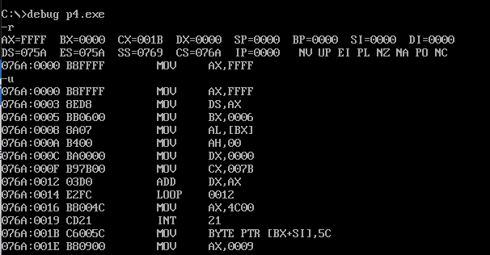

# `[BX]` 和 `loop` 指令

## `[bx]` 和内存单元的描述

`[bx]` 和 `[0]` 有些类似，`[0]` 表示内存单元，它的偏移地址是 `0`。比如在下面的
指令中:

```
mov ax,[0]
```

将一个内存单元的内容送入 `ax`，这个内存单元的长度为 `2` 字节（字单元），存放一个字，偏移地址为 `0`，段地址在 `ds` 中。

```
mov al,[0]
```

将一个内存单元的内容送入 `al`，这个内存单元的长度为 `1` 字节（字节单元），存放一个字节，偏移地址为 `0`，段地址在 `ds` 中。

要完整地描述一个内存单元，需要两种信息:
- 内存单元的地址
- 内存单元的长度（类型）

用 `[0]` 表示一个内存单元时，`0` 表示单元的偏移地址，段地址默认在 `ds` 中，单元的长度（类型）可以由具体指令中的其他操作对象（比如说寄存器）指出。

`[bx]` 同样也表示一个内存单元，它的偏移地址在 `bx` 中，比如下面的指令:

```
mov ax,[bx]
```

将一个内存单元的内容送入 `ax`，这个内存单元的长度为 `2` 字节（字单元），存放一个字，偏移地址在 `bx` 中，段地址在 `ds` 中。

```
mov al,[bx]
```

将一个内存单元的内容送入 `al`，这个内存单元的长度为 `1` 字节（字节单元），存放一个字节，偏移地址在 `bx` 中，段地址在 `ds` 中。

## `loop`

`loop` 指令和循环有关。

## 我们定义的描述性的符号: `()`

为了描述上的简洁，使用描述性的符号 `()` 来表示一个寄存器或一个内存单元中的内容。比如:

`(ax)` 表示 `ax` 中的内容、`(al)` 表示 `al` 中的内容

`(20000H)` 表示内存 `20000H` 单元的内容（`()` 中的内存单元的地址为物理地址）。

`((ds)*16+(bx))` 表示:

`ds` 中的内容为 `ADR1`，`bx` 中的内容为 `ADR2`，内存 `ADR1*16+ADR2` 单元的内容。

也可以理解为: `ds` 中的 `ADR1` 作为段地址，`bx` 中的 `ADR2` 作为偏移地址，内存 `ADR1:ADR2` 单元的内容。

`()` 中的元素可以有 `3` 种类型:
- 寄存器名
- 段寄存器名
- 内存单元的物理地址

比如:

`(ax)`、`(ds)`、`(al)`、`(cx)`、`(20000H)`、`((ds)*16+(bx))` 等是正确的用法，`(2000:0)`、`((ds):1000H)` 等是不正确的用法。

`(X)` 的应用，比如:
- `ax` 中的内容为 `0010H`，可以这样来描述: `(ax)=0010H`
- `2000:1000` 处的内容为 `0010H`，可以这样来描述: `(21000H)=0010H`
- 对于 `mov ax,[2]` 的功能，可以这样来描述: `(ax)=((ds)*16+2)`
- 对于 `mov [2],ax` 的功能，可以这样来描述: `((ds)*16+2)=(ax)`
- 对于 `add ax,2` 的功能，可以这样来描述: `(ax)=(ax)+2`
- 对于 `add ax,bx` 的功能，可以这样来描述: `(ax)=(ax)+(bx)`
- 对于 `push ax` 的功能，可以这样来描述:
  - `(sp)=(sp)-2`
  - `((ss)*16+(sp))=(ax)`
- 对于 `pop ax` 的功能，可以这样来描述:
  - `(ax)=((ss)*16+(sp))`
  - `(sp)=(sp)+2`

`(X)` 所表示的数据有两种类型:
- 字节
- 字

是哪种类型由寄存器名或具体的运算决定，比如:
- `(al)`、`(bl)`、`(cl)` 等得到的数据为字节型
- `(ds)`、`(ax)`、`(bx)` 等得到的数据为字型
- `(al)=(20000H)`，则 `(20000H)` 得到的数据为字节型
- `(ax)=(20000H)`，则 `(20000H)` 得到的数据为字型

## 约定符号 `idata` 表示常量

`mov ax,[0]`，表示将 `ds:0` 处的数据送入 `ax` 中。指令中，在 `[...]` 里用一个常量 `0` 表示内存单元的偏移地址。以后，用 `idata` 表示常量。比如:
- `mov ax,[idata]` 就代表 `mov ax,[1]`、`mov ax,[2]`、`mov ax,[3]` 等
- `mov bx,idata` 就代表 `mov bx,1`、`mov bx,2`、`mov bx,3` 等
- `mov ds,idata` 就代表 `mov ds,1`、`mov ds,2` 等，它们都是非法指令。

## `[BX]`

```
mov ax,[bx]
```

功能: `bx` 中存放的数据作为一个偏移地址 `EA`，段地址 `SA` 默认在 `ds` 中，将 `SA:EA` 处的数据送入 `ax` 中。即: `(ax)=((ds)*16+(bx))`。

```
mov [bx],ax
```

功能: `bx` 中存放的数据作为一个偏移地址 `EA`，段地址 `SA` 默认在 `ds` 中，将 `ax` 中的数据送入内存 `SA:EA` 处。即: `((ds)*16+(bx))=(ax)`。


注意，`inc bx` 的含义是 `bx` 中的内容加 `1`，比如下面两条指令:

```
mov bx,1
inc bx
```

执行后，`bx=2`。

先看一下程序的前 `3` 条指令:
```
mov ax,2000H
mov ds,ax
mov bx,1000H
```

这 `3` 条指令执行后，`ds=2000H`，`bx=1000H`。

接下来，第 `4` 条指令:

```
mov ax,[bx]
```

指令执行前: `ds=2000H`，`bx=1000H`，则 `mov ax,[bx]` 将把内存 `2000:1000` 处的字型数据送入 `ax` 中。该指令执行后，`ax=00beH`。

接下来，第 `5`、`6` 条指令:

```
inc bx
inc bx
```

这两条指令执行前 `bx=1000H`，执行后 `bx=1002H`。

接下来，第 `7` 条指令:

```
mov [bx],ax
```

指令执行前: `ds=2000H`，`bx=1002H`，则 `mov [bx],ax` 将把 `ax` 中的数据送入内存 `2000:1002` 处。指令执行后，`2000:1002` 单元的内容为 `BE`，`2000:1003` 单元的内容为 `00`。

接下来，第 `8`、`9` 条指令:

```
inc bx
inc bx
```

这两条指令执行前 `bx=1002H`，执行后 `bx=1004H`。

接下来，第 `10` 条指令:

```
mov [bx],ax
```

指令执行前: `ds=2000H`，`bx=1004H`，则 `mov [bx],ax` 将把 `ax` 中的数据送入内存 `2000:1004` 处。指令执行后，`2000:1004` 单元的内容为 `BE`，`2000:1005` 单元的内容为 `00`。

接下来，第 `11` 条指令:

```
inc bx
```

这条指令执行前 `bx=1004H`，执行后 `bx=1005H`。

接下来，第 `12` 条指令:

```
mov [bx],al
```

指令执行前: `ds=2000H`，`bx=1005H`，则 `mov [bx],al` 将把 `al` 中的数据送入内存 `2000:1005` 处。指令执行后，`2000:1005` 单元的内容为 `BE`。

接下来，第 `13` 条指令:

```
inc bx
```

这条指令执行前 `bx=1005H`，执行后 `bx=1006H`。

接下来，第 `14` 条指令:

```
mov [bx],al
```

指令执行前: `ds=2000H`，`bx=1006H`，则 `mov [bx],al` 将把 `al` 中的数据送入内存 `2000:1006` 处。指令执行后，`2000:1006` 单元的内容为 `BE`。

程序执行后，内存中的情况如图所示:


## `Loop` 指令

`loop` 指令的格式是: `loop 标号`，`CPU` 执行 `loop` 指令的时候，要进行两步操作:
- `(cx)=(cx)-1`
- 判断 `cx` 中的值，不为零则转至标号处执行程序，如果为零则向下执行

从上面的描述中，可以看到，`cx` 中的值影响着 `loop` 指令的执行结果。通常用 `loop` 指令来实现循环功能，`cx` 中存放循环次数。

任务 `1`: 编程计算 `2^2`，结果存在 `ax` 中。

分析: 设 `(ax)=2`，可计算 `(ax)=(ax)*2`，最后 `(ax)` 中为 `2^2` 的值。`N*2` 可用 `N+N` 实现，程序如下:

```asm
assume cs:code
code segment
    mov ax,2
    add ax,ax

    mov ax,4c00h
    int 21h
code ends
end
```

任务 `2`: 编程计算 `2^3`。

分析: `2^3=2*2*2`，若设 `(ax)=2`，可计算 `(ax)=(ax)*2*2`，最后 `(ax)` 中为 `2^3` 的值。`N*2` 可用 `N+N` 实现，程序如下:

```asm
assume cs:code
code segment
    mov ax,2
    add ax,ax
    add ax,ax

    mov ax,4c00h
    int 21h
code ends
end
```

任务 `3`: 编程计算 `2^12`。

分析: `2^12-2*2*2*2*2*2*2*2*2*2*2*2`，若设 `(ax)=2`，可计算 `(ax)=(ax)*2*2*2*2*2*2*2*2*2*2*2`，最后 `(ax)` 中为 `2^12` 的值。`N*2` 可用 `N+N` 实现，程序如下:

```asm
assume cs:code
code segment
    mov ax,2
    ; 做 11 次 add ax,ax

    mov ax,4c00h
    int 21h
code ends
end
```

按照我们的算法，计算 `2^12` 需要 `11` 条重复的指令 `add ax,ax`。这里，可用 `loop` 来简化程序。

```asm
assume cs:code
code segment
    mov ax,2
    mov cx,11
s:  add ax,ax
    loop s

    mov ax,4c00h
    int 21h
code ends
end
```

- 标号
  - 在汇编语言中，标号代表一个地址，程序中有一个标号 `s`。它实际上标识了一个地址，这个地址处有一条指令: `add ax,ax`。
- `loop s`
  - `CPU` 执行 `loop s` 的时候，要进行两步操作:
    - `(cx)=(cx)-1`
    - 判断 `cx` 中的值，不为 `0` 则转至标号 `s` 所标识的地址处执行，如果为 `0` 则执行下一条指令。
- 以下 `3` 条指令
  ```asm
      mov cx,11
  s:  add ax,ax
      loop s
  ```
  - 执行 `loop s` 时，首先要将 `(cx)` 减 `1`，然后若 `(cx)` 不为 `0`，则向前转至 `s` 处执行。所以，可以利用 `cx` 来控制 `add ax,ax` 的执行次数。
  
`cx` 和 `loop` 指令相配合实现循环功能的 `3` 个要点:
- 在 `cx` 中存放循环次数
- `loop` 指令中的标号所标识地址要在前面
- 要循环执行的程序段，要写在标号和 `loop` 指令的中间

用 `cx` 和 `loop` 指令相配合实现循环功能的程序框架如下:

```asm
    mov cx,循环次数
s:
    循环执行的程序段
    loop s
```

计算乘法，可用较小的数字作为循环次数，提高计算速度。

## 在 `Debug` 中跟踪用 `loop` 指令实现的循环程序

考虑这样一个问题，计算 `ffff:0006` 单元中的数乘以 `3`，结果存储在 `dx` 中。

### 运算后的结果是否会超出 `dx` 所能存储的范围？

`ffff:0006` 单元中的数是一个字节型的数据，范围在 `0~255` 之间，则用它和 `3` 相乘结果不会大于 `65535`，可以在 `dx` 中存放下。

### 用循环累加来实现乘法，用哪个寄存器进行累加？

将 `ffff:0006` 单元中的数赋值给 `ax`，用 `dx` 进行累加。先设 `(dx)=0`，然后做 `3` 次 `(dx)=(dx)+(ax)`。

### `ffff:6` 单元是一个字节单元，`ax` 是一个 `16` 位寄存器，数据的长度不一样，如何赋值？

赋值就是让 `ax` 中的数据的值（数据的大小）和 `ffff:0006` 单元中的数据的值（数据的大小)相等。`8` 位数据 `01H` 和 `16` 位数据 `0001H` 的数据长度不一样，但它们的值是相等的。

设 `ffff:0006` 单元中的数据是 `XXH`，若要 `ax` 中的值和 `ffff:0006` 单元中的相等，`ax` 中的数据应为 `00XXH`。所以，若实现 `ffff:0006` 单元向 `ax` 赋值，应该令 `(ah)=0`，`(al)=(ffff6H)`。

```asm
assume cs:code
code segment
    mov ax,0ffffh
    mov ds,ax
    mov bx,6  ; 以上，设置 ds:bx 指向 ffff:6

    mov al,[bx]
    mov ah,0  ; 以上，设置 (al)=((ds*16)+(bx))，(ah)=0

    mov dx,0  ; 累加寄存器清 0
    mov cx,3  ; 循环 3 次
  s:add dx,ax
    loop s    ; 以上累加计算 (ax)*3

  mov ax,4c00h
  int 21h     ; 程序返回

code ends
end
```

第一条指令 `mov ax,0ffffh`。大于 `9FFFh` 的十六进制数据 `A000H`、`A001H`...`C000H`、`C001H`...`FFFEH`、`FFFFH` 等，在书写的时候都是以字母开头的。而在汇编源程序中，数据不能以字母开头，所以要在前面加 `0`。比如，`9138h` 在汇编源程序中可以直接写为 `9138h`，而 `A000h` 在汇编源程序中要写为 `0A000h`。

下面对程序的执行过程进行跟踪。首先，将它编辑为源程序文件，文件名定为 `p3.asm`，对其进行编译连接后生成 `p3.exe`，然后再用 `Debug` 对 `p3.exe` 中的程序进行跟踪。


`(ds)=075A`，所以，程序在 `076A:0000` 处。`(cs)=076AH`，`(IP)=0`，`CS:IP` 正指向程序的第一条指令。再用 `u` 命令看一下被 `Debug` 加载入内存的程序:


可以看到，从 `076A:0000~076A:001A` 是程序，`076A:0014` 处是源程序中的指令 `loop s`，只是此处 `loop s` 中的标号 `s` 已经变为一个地址 `0012h`。如果在执行 `loop 0012` 时，`cx` 减 `1` 后不为 `0`，`loop 0012` 就把 `IP` 设置为 `0012h`，从而使 `CS:IP` 指向 `076A:0012` 处的 `add dx,ax`，实现转跳。


前 `3` 条指令执行后，`(ds)=ffffh`，`(bx)=6`，`ds:bx` 指向 `ffff:6` 单元。`Debug` 显示出当前要执行的指令 `mov al,[bx]`，因为是读取内存的指令，所以 `Debug` 将要访问的内存单元中的内容也显示出来，可以看到屏幕最右边显示的 `ds:0006=31`，由此，可以方便地知道目标单元 `(ffff6)` 中的内容是 `31h`。


这两条指令执行后，`(ax)=0032h`，完成了从 `ffff:6` 单元向 `ax` 的赋值。


这两条指令执行后，`(dx)=0`，完成对累加寄存器的初始化，`(cx)=3`，完成对循环计数寄存器的初始化。

下面，将开始循环程序段的执行:


`CPU` 执行 `076A:0012` 处的指令 `add dx,ax` 后，`(IP)=0014h`，`CS:IP` 指向 `076A:0014` 处的指令 `loop 0012`。`CPU` 执行 `loop 0012`，第一步先将 `(cx)` 减 `1`，`(cx)=2`，第二步因 `(cx)` 不等于 `0`，将 `IP` 设为 `0012h`。指令 `loop 0012` 执行后，`(IP)=0012h`，`CS:IP` 再次指向 `076A:0012` 处的指令 `add dx,ax`，这条指令将再次得到执行。注意，`loop 0012` 执行后 `(cx)=2`，也就是说，`loop 0012` 还可以进行两次循环。


接着，将重复执行 `add dx,ax` 和 `loop 0012`，直到 `(cx)=0` 为止，

最后一次执行 `loop 0012`。执行前 `(cx)=1`，`CPU` 执行 `loop 0012`，第一步，`(cx)=(cx)-1`，`(cx)=0`。第二步，因为 `(cx)=0`，所以 `loop` 指令不转跳，`(IP)=0016h`，`CPU` 向下执行 `076A:0016` 处的指令 `mov ax,4c00`。

在完成最后一次 `add dx,ax` 后，`(dx)=93h`，此时 `dx` 中为累加计算 `(ax)*3` 的最后结果。


执行完最后两条指令后，程序返回到 `Debug` 中。`int 21` 要用 `p` 命令执行。

下面，计算 `ffff:0006` 单元中的数乘以 `123`，结果存储在 `dx` 中。只要将循环的次数改为 `123` 就可以了。程序如下:

```asm
assume cs:code
code segment
    mov ax,0ffffh
    mov ds,ax
    mov bx,6  ; 以上，设置 ds:bx 指向 ffff:6

    mov al,[bx]
    mov ah,0  ; 以上，设置 (al)=((ds*16)+(bx))，(ah)=0

    mov dx,0  ; 累加寄存器清 0
    mov cx,123; 循环 123 次
  s:add dx,ax
    loop s    ; 以上累加计算 (ax)*3

  mov ax,4c00h
  int 21h     ; 程序返回

code ends
end
```

`Debug` 对这个程序的循环程序段进行跟踪，现在有这样一个问题: 标号 `s` 前的指令，已经确定在逻辑上完全正确，不想再一步步地跟踪了，只想跟踪循环的过程。所以希望可以一次执行完标号 `s` 前的指令。可以用一个新的 `Debug` 命令 `g` 来达到目的。



循环程序段从 `CS:0012` 开始，`CS:0012` 前面的指令，不想一步步地跟踪，希望能够一次执行完，然后从 `CS:0012` 处开始跟踪。可以这样来使用 `g` 命令: `g 0012`，它表示执行程序到当前代码段（段地址在 `CS` 中）的 `0012h` 处。也就是说 `g 0012` 将使 `Debug` 从当前的 CS:IP 指向的指令执行，一直到 `(IP)=0012`h 为止。


`Debug` 执行 `g 0012` 后，`CS:0012` 前的程序段被执行，从各个相关的寄存器中的值，可以看出执行的结果。

不想再继续一步步地观察循环的过程了，怎样让程序向下执行呢？

可以使用 `p` 命令来达到目的。再次遇到 `loop` 指令时，使用 `p` 命令来执行，`Debug` 就会自动重复执行循环中的指令，直到 `(cx)=0` 为止:


也可以用 `g` 命令来达到目的，可以用 `g 0016` 直接执行到 `CS:0016` 处:


## `Debug` 和汇编编译器 `masm` 对指令的不同处理

在 `Debug` 中写过类似的指令:

```asm
mov ax,[0]
```

表示将 `ds:0` 处的数据送入 `ax` 中。

但是在汇编源程序中，指令 `mov ax,[0]` 被编译器当作指令 `mov ax,0` 处理。

任务: 将内存 `2000:0`、`2000:1`、`2000:2`、`2000:3` 单元中的数据送入 `al`、`bl`、`cl`、`dl`中。

在 `Debug` 中编程实现:

```asm
mov ax,2000
mov ds,ax
mov al,[0]
mov bl,[1]
mov cl,[2]
mov dl,[3]
```

汇编源程序实现:

```asm
assume cs:code
code segment
    mov ax,2000h
    mov ds,ax
    mov al,[0]
    mov bl,[1]
    mov cl,[2]
    mov dl,[3]
    mov ax,4c00h
  int 21h
code ends
end
```

看一下两种实现的实际实施情况:

`Debug` 中的情况:


汇编源程序中的情况:


从图中可以明显地看出，`Debug` 和编译器 `masm` 对形如 `mov ax,[0]` 这类指令在解释上的不同。Debug 解释为 `[idata]` 是一个内存单元，`idata` 是内存单元的偏移地址，而编译器将 `[idata]` 解释为 `idata`。

那么如何在源程序中实现将内存 `2000:0`、`2000:1`、`2000:2`、`2000:3` 单元中的数据送入 `al`、`bl`、`cl`、`dl` 中呢？

目前的方法是，可将偏移地址送入 `bx` 寄存器中，用 `[bx]` 的方式来访问内存单元。比如可以这样访问 `2000:0` 单元:

```asm
mov ax,2000h
mov ds,ax   ; 段地址 2000h 送入 ds
mov bx,0    ; 偏移地址 0 送入 bx
mov al,[bx] ; ds:bx 单元中的数据送入 al
```
这样做是可以，可是比较麻烦，要用 `bx` 来间接地给出内存单元的偏移地址。希望能够像在 `Debug` 中那样，在 `[]` 中直接给出内存单元的偏移地址。这样做，在汇编源程序中也是可以的，只不过，要在 `[]` 的前面显式地给出段地址所在的段寄存器。比如可以这样访问 `2000:0` 单元：

```asm
mov ax,000h
mov ds,ax
mov al,ds:[0]
```

比较一下汇编源程序中以下指令的含义:
- `mov al,[0]`，含义: `(a)=0`，将常量 `0` 送入 `al` 中（与 `mov al,0` 含义相同）
- `mov al,ds:[0]`，含义: `(al)=((ds)*16+0)` ，将内存单元中的数据送入 `al` 中
- `mov al,[bx]`，含义: `(al) =((ds)*16+(bx))` ，将内存单元中的数据送入 `al` 中
- `mov al,ds:[bx]`，含义: 与 `mov al,[bx]` 相同。

从上面的比较中可以看出:
- 在汇编源程序中，如果用指令访问一个内存单元，则在指令中必须用 `[...]` 来表示内存单元，如果在 `[]` 里用一个常量 `idata` 直接给出内存单元的偏移地址，就要在 `[]` 的前面显式地给出段地址所在的段寄存器。
- 如果在 `[]` 里用寄存器，比如 `bx`，间接给出内存单元的偏移地址，则段地址默认在 `ds` 中。当然，也可以显式地给出段地址所在的段寄存器。

## `loop` 和 `[bx]` 的联合应用

计算 `ffff:0~ffff:b` 单元中的数据的和，结果存储在 `dx` 中。

### 运算后的结果是否会超出 `dx` 所能存储的范围？

`ffff:0~ffff:b` 内存单元中的数据是字节型数据，范围在 `0~255` 之间，`12` 个这样的数据相加，结果不会大于 `65535`，可以在 `dx` 中存放下。

### 能否将 `ffff:0~ffff:b` 中的数据直接累加到 `dx` 中？

当然不行，因为 `ffff:0~ffff:b` 中的数据是 `8` 位的，不能直接加到 `16` 位寄存器 `dx` 中。

### 能否将 `ffff:0~ffff:b` 中的数据累加到 `dl` 中，并设置 `(dh)=0`，从而实现累加到 dx 中？

这也不行，因为 `dl` 是 8 位寄存器，能容纳的数据的范围在 0~255 之间，`ffff:0~ffff:b` 中的数据也都是 `8` 位，如果仅向 `dl` 中累加 `12` 个 `8` 位数据，很有可能造成进位丢失。

### 怎样将 `ffff:0~ffff:b` 中的 `8` 位数据，累加到 `16` 位寄存器 `dx` 中？

从上面的分析中，可以看到，这里面有两个问题: 类型的匹配和结果的不超界。具体地说，就是在做加法的时候，有两种方法:
- `(dx)=(dx)+内存中的8位数据`
- `(dl)=(dl)+内存中的8位数据`

第一种方法中的问题是两个运算对象的类型不匹配，第二种方法中的问题是结果有可能超界。

目前的方法就是得用一个 `16` 位寄存器来做中介。将内存单元中的 `8` 位数据赋值到一个 `16` 位寄存器 `ax` 中，再将 `ax` 中的数据加到 `dx` 上，从而使两个运算对象的类型匹配并且结果不会超界。

```asm
assume cs:code
code segment
    mov ax,0ffffh   ; 设置 (ds)=ffffh
    mov ds,ax
    mov dx,0        ; 初始化累加寄存器，(dx)=0
    mov al,ds:[0]
    mov ah,0        ; (ax)=((ds)*16+0)=(ffff0h)
    add dx,ax       ; 向 dx 中加上 ffff:0 单元的数值
    mov al,ds:[1]
    mov ah,0        ; (ax)=((ds)*16+1)=(ffff1h)
    add dx,ax       ; 向 dx 中加上 ffff:1 单元的数值
    mov al,ds:[2]
    mov ah,0        ; (ax)=((ds)*16+2)=(ffff2h)
    add dx,ax       ; 向 dx 中加上 ffff:2 单元的数值
    mov al,ds:[3]
    mov ah,0        ; (ax)=((ds)*16+3)=(ffff3h)
    add dx,ax       ; 向 dx 中加上 ffff:3 单元的数值
    mov al,ds:[4]
    mov ah,0        ; (ax)=((ds)*16+4)=(ffff4h)
    add dx,ax       ; 向 dx 中加上 ffff:4 单元的数值
    mov al,ds:[5]
    mov ah,0        ; (ax)=((ds)*16+5)=(ffff5h)
    add dx,ax       ; 向 dx 中加上 ffff:5 单元的数值
    mov al,ds:[6]
    mov ah,0        ; (ax)=((ds)*16+6)=(ffff6h)
    add dx,ax       ; 向 dx 中加上 ffff:6 单元的数值
    mov al,ds:[7]
    mov ah,0        ; (ax)=((ds)*16+7)=(ffff7h)
    add dx,ax       ; 向 dx 中加上 ffff:7 单元的数值
    mov al,ds:[8]
    mov ah,0        ; (ax)=((ds)*16+8)=(ffff8h)
    add dx,ax       ; 向 dx 中加上 ffff:8 单元的数值
    mov al,ds:[9]
    mov ah,0        ; (ax)=((ds)*16+9)=(ffff9h)
    add dx,ax       ; 向 dx 中加上 ffff:9 单元的数值
    mov al,ds:[0ah]
    mov ah,0        ; (ax)=((ds)*16+0ah)=(ffffah)
    add dx,ax       ; 向 dx 中加上 ffff:a 单元的数值
    mov al,ds:[0bh]
    mov ah,0        ; (ax)=((ds)*16+0bh)=(ffffbh)
    add dx,ax       ; 向 dx 中加上 ffff:b 单元的数值
    mov ax,4c00h    ; 程序返回
    int 21h
code ends
end
```

### 应用 `loop` 指令，改进程序

可以看出，在程序中，有 `12` 个相似的程序段，将它们一般化地描述为:

```asm
mov al,ds:[X]   ; ds:X 指向 ffff:X 单元
mov ah,0        ; (ax)=((ds)*16+(X)))=(ffffXh)
add dx,ax       ; 向 dx 中加上 ffff:X 单元的数值
```

可以看到，`12` 个相似的程序段中，只有 `mov al,ds:[X]` 指令中的内存单元的偏移地址是不同的，其他都一样。而这些不同的偏移地址是在 `0≤X≤bH` 的范围内递增变化的。


用数学语言来描述这个累加的运算:

$sum = \sum_{\rm X = 0}^{\rm 0bH}(\rm ffffh * 10h + X)$

从程序实现上，循环做。

```
(al)=((ds)*16+X)
(ah)=0
(dx)=(dx)+(ax)
```

一共循环 `12` 次，在循环开始前 `(ds)=ffffh`，`X=0`，`ds:X` 指向第一个内存单元。每次循环后，`X` 递增，`ds:X` 指向下一个内存单元。

完整的算法描述如下。

初始化:
```
(ds)=ffffh
X=0
(dx)=0
```

循环 `12` 次:

```
(al)=((ds)*16+X)
(ah)=0
(dx)=(dx)+(ax)
X=X+1
```

`loop` 指令实现循环 `12` 次。

更详细的算法描述如下。

初始化:

```
(ds)=ffffh
(bx)=0
(dx)=0
(cx)=12
```

循环 `12` 次:

```
s:(al)=((ds)*16+(bx))
  (ah)=0
  (dx)=(dx)+(ax)
  (bx)=(bx)+1
  loop s
```

完整程序如下:

```asm
assume cs:code
code segment
    mov ax,0ffffh
    mov ds,ax
    mov bx,0        ; 初始化 ds:bx 指向 ffff:0

    mov dx,0        ; 初始化累加寄存器，(dx)=0

    mov cx,12       ; 初始化循环计数寄存器 cx，(cx)=12

s:  mov al,[bx]
    mov ah,0
    add dx,ax       ; 间接向 dx 中加上 ((ds)*16+(bx)) 单元的数值
    inc bx          ; ds:bx 指向下一个单元
    loop s

    mov ax,4c00h
    int 21h
code ends
end
```

在实际编程中，经常会遇到，用同一种方法处理地址连续的内存单元中的数据的问题。需要用循环来解决这类问题，同时必须能够在每次循环的时候按照同一种方法来改变要访问的内存单元的地址。这时，就不能用常量来给出内存单元的地址，而应用变量。`bx` 就可以看作一个代表内存单元地址的变量，可以不写新的指令，仅通过改变 `bx` 中的数值，改变指令访问的内存单元。

## 段前缀

指令 `mov ax,[bx]` 中，内存单元的偏移地址由 `bx` 给出，而段地址默认在 `ds` 中。可以在访问内存单元的指令中显式地给出内存单元的段地址所在的段寄存器。比如:
- `mov ax,ds:[bx]`
  - 将一个内存单元的内容送入 `ax`，这个内存单元的长度为 `2` 字节（字单元），存放一个字，偏移地址在 `bx` 中，段地址在 `ds` 中。
- `mov ax,cs:[bx]`
  - 将一个内存单元的内容送入 `ax`，这个内存单元的长度为 `2` 字节（字单元），存放一个字，偏移地址在 `bx` 中，段地址在 `cs` 中。
- `mov ax,ss:[bx]`
  - 将一个内存单元的内容送入 `ax`，这个内存单元的长度为 `2` 字节（字单元），存放一个字，偏移地址在 `bx` 中，段地址在 `ss` 中。
- `mov ax,es:[bx]`
  - 将一个内存单元的内容送入 `ax`，这个内存单元的长度为 `2` 字节（字单元），存放一个字，偏移地址在 `bx` 中，段地址在 `es` 中。
- `mov ax,ss:[0]`
  - 将一个内存单元的内容送入 `ax`，这个内存单元的长度为 `2` 字节（字单元），存放一个字，偏移地址为 `0`，段地址在 `ss` 中。
- `mov ax,cs:[0]`
  - 将一个内存单元的内容送入 `ax`，这个内存单元的长度为 `2` 字节（字单元），存放一个字，偏移地址为 `0`，段地址在 `cs` 中。

这些出现在访问内存单元的指令中，用于显式地指明内存单元的段地址的 `ds:`、`cs:`、`ss:`、`es:`，在汇编语言中称为 `段前缀`。

## 一段安全的空间

在 `8086` 模式中，随意向一段内存空间写入内容是很危险的，因为这段空间中可能存放着重要的系统数据或代码。比如下面的程序:

```asm
assume cs:code
code segment
    mov ax,0
    mov ds,ax
    mov ds:[26h],ax
    mov ax,4c00h
    int 21h
code ends
end
```


可以看到，源程序中的 `mov ds:[26h],ax` 被 `masm` 翻译为机器码 `A32600`，而 `Debug` 将这个机器码解释为 `mov [0026],ax`。

在 `Debug` 里执行 `mov [0026],ax` 或者在实模式下执行程序 `p7.exe`，将会引起死机。产生这种结果的原因是 `0:0026` 处存放着重要的系统数据，而 `mov [0026],ax` 将其改写。

可见，在不能确定一段内存空间中是否存放着重要的数据或代码的时候，不能随意向其中写入内容。

不要忘记，我们是在操作系统的环境中工作，操作系统管理所有的资源，也包括内存。如果我们需要向内存空间写入数据的话，要使用操作系统给我们分配的空间，而不应直接用地址任意指定内存单元，向里面写入。

注意，在实模式下，可以不理会 `DOS`，直接用汇编语言去操作真实的硬件，因为运行在 `CPU` 实模式下的 `DOS`，没有能力对硬件系统进行全面、严格的管理。但在 `Windows 2000`、`Unix` 这些运行于 `CPU` 保护模式下的操作系统中，不理会操作系统，用汇编语言去操作真实的硬件，是不可能的。硬件已被这些操作系统利用 `CPU` 保护模式所提供的功能全面而严格地管理了。

需要要找到一段安全的空间供我们使用。在一般的 `PC` 机中，`DOS` 方式下，`DOS` 和其他合法的程序一般都不会使用 `0:200~0:2ff`（`00200h~002ffh`）的 `256` 个字节的空间。所以，我们使用这段空间是安全的。进入 `DOS` 后，可以先用 `Debug` 查看一下，如果 `0:200~0:2ff` 单元的内容都是 `0` 的话，则证明 `DOS` 和其他合法的程序没有使用这里。

## 段前缀的使用

将内存 `ffff:0~ffff:b` 单元中的数据复制到 `0:200~0:20b` 单元中:
- `0:200~0:20b` 单元等同于 `0020:0~0020:b` 单元，它们描述的是同一段内存空间。
- 复制的过程应用循环实现，简要描述如下:
  - 初始化:
    -  `X=0`
  - 循环 `12` 次:
    - 将 `ffff:X` 单元中的数据送入 `0020:X`（需要用一个寄存器中转）
    - `X=X+1`
- 在循环中，源始单元 `ffff:X` 和目标单元 `0020:X` 的偏移地址 `X` 是变量。用 `bx` 来存放。
- 将 `0:200~0:20b` 用 `0020:0~0020:b` 描述，就是为了使目标单元的偏移地址和源始单元的偏移地址从同一数值 `0` 开始。

程序如下:

```asm
assume cs:code
code segment
    mov bx,0      ; (bx)=0，偏移地址从 0 开始
    mov cx,12     ; (cx)=12，循环 12 次
s:  mov ax,0ffffh
    mov ds,ax     ; (ds)=0ffffh
    mov dl,[bx]   ; (dl)=((ds)*16+(bx))，将 ffff:bx 中的数据送入 dl
    mov ax,0020h
    mov ds,ax     ; (ds)=0020h
    mov [bx],dl   ; ((ds)*16+(bx))=(dl)，将中 dl 的数据送入 0020:bx
    inc bx        ; (bx)=(bx)+1
    loop s
    mov ax,4c00h
    int 21h
code ends
end
```

因源始单元  `ffff:X` 和目标单元 `0020:X` 相距大于 `64KB`，在不同的 `64KB` 段里，每次循环要设置两次 `ds`。这样做是正确的，但是效率不高。可以使用两个段寄存器分别存放源始单元 `ffff:X` 和目标单元 `0020:X` 的段地址，这样就可以省略循环中需要重复做 `12` 次的设置 `ds` 的程序段。

改进的程序如下:

```asm
assume cs:code
code segment
    mov ax,0ffffh
    mov ds,ax     ; (ds)=0ffffh

    mov ax,0020h
    mov es,ax     ; (es)=0020h

    mov bx,0      ; (bx)=0，ds:bx 指向 ffff:0，es:bx 指向 0020:0
    mov cx,12     ; (cx)=12，循环 12 次

s:  mov dl,[bx]   ; (dl)=((ds)*16+(bx))，将 ffff:bx 中的数据送入 dl
    mov es:[bx],dl   ; ((es)*16+(bx))=(dl)，将中 dl 的数据送入 0020:bx
    inc bx        ; (bx)=(bx)+1
    loop s

    mov ax,4c00h
    int 21h
code ends
end
```

使用 `es` 存放目标空间 `0020:0~0020:b` 的段地址，用 `ds` 存放源始空间 `ffff:0~ffff:b` 的段地址。在访问内存单元的指令中，显式地用段前缀 `es:` 给出单元的段地址，这样就不必在循环中重复设置 `ds`。