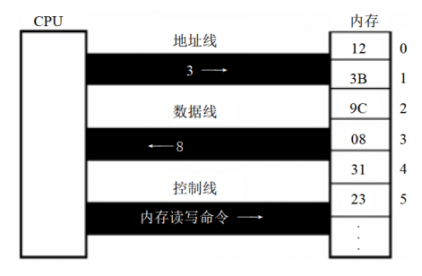

# 基础知识

汇编语言是直接在硬件之上工作的编程语言。在本章主要对硬件系统结构的问题进行一部分的探讨。

## 1.1 机器语言

机器语言是机器指令的集合。机器指令就是一台机器可以正确执行的命令。

电子计算机的机器指令是一列二进制数字。计算机将之转变为一列高低电平，以使计算机的电子器件受到驱动，进行运算。

现在，在常用的 `PC` 机中，`CPU`（`Central Processing Unit`，中央处理单元）来完成上面所说的计算机的功能，`CPU` 是一种微处理器。

每一种微处理器，由于硬件设计和内部结构的不同，就需要用不同的电平脉冲来控制，使它工作。所以每一种微处理器都有自己的机器指令集，也就是机器语言。

早期的程序设计均使用机器语言。程序员们将用 0、1 数字编成的程序代码打在纸带或卡片上，再将程序通过纸带机或卡片机输入计算机，进行运算。

应用 `8086CPU` 完成运算 `s=768+12288-1280`，机器码如下:

```
101110000000000000000011
000001010000000000110000
001011010000000000000101
```

书写和阅读机器码程序不是一件简单的工作，要记住所有抽象的二进制码。

## 1.2 汇编语言的产生

机器语言难于辨别和记忆，于是汇编语言产生了。

汇编语言的主体是汇编指令。汇编指令和机器指令的差别在于指令的表示方法上。汇编指令是机器指令便于记忆的书写格式。

例如: 机器指令 `1000100111011000` 表示把寄存器 `BX` 的内容送到 `AX` 中。汇编指令则写成 `mov ax,bx`。这样的写法与人类语言接近，便于阅读和记忆。

寄存器，简单地讲是 `CPU` 中可以存储数据的器件，一个 `CPU` 中有多个寄存器。`AX` 是其中一个寄存器的代号，`BX` 是另一个寄存器的代号。

但是计算机能读懂的只有机器指令，这时，就需要有一个能够将汇编指令转换成机器指令的翻译程序，这样的程序称其为编译器。程序员用汇编语言写出源程序，再用汇编编译器将其编译为机器码，由计算机最终执行。


## 1.3 汇编语言的组成

汇编语言有以下 `3` 类指令组成:

- 汇编指令: 机器码的助记符，有对应的机器码。
- 伪指令: 没有对应的机器码，由编译器执行，计算机并不执行。
- 其他符号: 如 `+`、`-`、`*`、`/` 等，由编译器识别，没有对应的机器码。

汇编语言的核心是汇编指令，它决定了汇编语言的特性。

## 1.4 存储器

`CPU` 是计算机的核心部件，控制整个计算机的运作并进行运算。要想让一个 `CPU` 工作，就必须向它提供指令和数据。指令和数据在存储器中存放，也就是内存。

磁盘不同于内存，磁盘上的数据或程序如果不读到内存中，就无法被 `CPU` 使用。

## 1.5 指令和数据

指令和数据是应用上的概念。在内存或磁盘上，指令和数据没有任何区别，都是二进制信息。`CPU` 在工作的时候把有的信息看作指令，有的信息看作数据，为同样的信息赋予了不同的意义。

例如，内存中的二进制信息 `1000100111011000`，计算机可以把它看作大小为 `89D8H` 的数据来处理，也可以将其看作指令 `mov ax,bx` 来执行。

## 1.6 存储单元

存储器被划分成若干个存储单元，每个存储单元从 `0` 开始顺序编号，例如一个存储器有 `128` 个存储单元，编号从 `0~127`，如图所示:


电子计算机的最小信息单位是 `bit`，也就是一个二进制位。`8` 个 `bit` 组成一个 `Byte`（字节）。微型机存储器的存储单元可以存储一个 `Byte`，即 `8` 个二进制位。

微机存储器的容量是以字节为最小单位来计算的。对于拥有 `128` 个存储单元的存储器，它的容量是 `128` 个字节。

对于大容量的存储器一般还用以下单位来计量容量（以下用 `B` 来代表 `Byte`）:

```
lKB=1024B lMB=1024KB 1GB=1024MB 1TB=1024GB
```

磁盘的容量单位同内存的一样。

## 1.7 `CPU` 对存储器的读写

存储器被划分成多个存储单元，存储单元从零开始顺序编号。这些编号可以看作存储单元在存储器中的地址。

`CPU` 要从内存中读数据，首先要指定存储单元的地址。也就是说它要先确定它要读取哪一个存储单元中的数据。

另外，在一台微机中，不只有存储器这一种器件。`CPU` 在读写数据时还要指明，它要对哪一个器件进行操作，进行哪种操作，是从中读出数据，还是向里面写入数据。

可见，CPU 要想进行数据的读写，必须和外部器件进行下面 `3` 类信息的交互:
- 存储单元的地址（地址信息）
- 器件的选择，读或写的命令（控制信息）
- 读或写的数据（数据信息）

电子计算机能处理、传输的信息都是电信号，要用导线传送。在计算机中专门有连接 `CPU` 和其他芯片的导线，通常称为总线。总线从物理上来讲，就是一根根导线的集合。

根据传送信息的不同，总线从逻辑上又分为 `3` 类，地址总线、控制总线和数据总线。

`CPU` 从 `3` 号单元中读取数据的过程如下:



- `CPU` 通过地址线将地址信息 `3` 发出
- `CPU` 通过控制线发出内存读命令，选中存储器芯片，并通知它，将要从中读取数据
- 存储器将 `3` 号单元中的数据 `8` 通过数据线送入 `CPU`

写操作与读操作的步骤相似。如向 `3` 号单元写入数据 `26`:

- `CPU` 通过地址线将地址信息 `3` 发出
- `CPU` 通过控制线发出内存写命令，选中存储器芯片，并通知它，要向其中写入数据
- `CPU` 通过数据线将数据 `26` 送入内存的 `3` 号单元中

要让一个计算机或微处理器工作，应向它输入能够驱动它进行工作的电平信息。对于 `8086CPU`，下面的机器码，能够完成从 `3` 号单元读数据:

- 机器码: `101000010000001100000000`
- 含义: 从 `3` 号单元读取数据送入寄存器 `AX`

CPU 接收这条机器码后将完成上面所述的读写工作。

机器码难于记忆，用汇编指令来表示，情况如下:
- 机器码: `101000010000001100000000`
- 对应的汇编指令: `MOV AX,[3]`
- 含义: 传送 `3` 号单元的内容入 `AX`

## 1.8 地址总线

`CPU` 是通过地址总线来指定存储器单元的。地址总线上能传送多少个不同的信息，`CPU` 就可以对多少个存储单元进行寻址。

现假设，一个 `CPU` 有 `10` 根地址总线，发出地址信息 `11` 时 `10` 根地址线上传送的二进制信息:


一个 `CPU` 有 `N` 根地址线，则可以说这个 `CPU` 的地址总线的宽度为 `N`。这样的 `CPU` 最多可以寻找 `2` 的 `N` 次方个内存单元。

## 1.9 数据总线

`CPU` 与内存或其他器件之间的数据传送是通过数据总线来进行的。数据总线的宽度决定了 `CPU` 和外界的数据传送速度。`8` 根数据总线一次可传送一个 `8` 位二进制数据（一个字节）。`16` 根数据总线一次可传送两个字节。

`8088CPU` 的数据总线宽度为 `8`，`8086CPU` 的数据总线宽度为 `16`。它们向内存中写入数据 `89D8H` 时，通过数据总线传送数据:


`8086` 有 `16` 根数据线，可一次传送 `16` 位数据，所以可一次传送数据 `89D8H`，而 `8088` 只有 `8` 根数据线，一次只能传 `8` 位数据，所以向内存写入数据 `89D8H` 时需要进行两次数据传送。

## 1.10 控制总线

`CPU` 对外部器件的控制是通过控制总线来进行的。在这里控制总线是个总称，控制总线是一些不同控制线的集合。有多少根控制总线，就意味着 `CPU` 提供了对外部器件的多少种控制。所以，控制总线的宽度决定了 `CPU` 对外部器件的控制能力。

前面所讲的内存读或写命令是由几根控制线综合发出的，其中有一根称为读信号输出的控制线负责由 `CPU` 向外传送读信号，`CPU` 向该控制线上输出低电平表示将要读取数据。有一根称为写信号输出的控制线则负责传送写信号。

## 1.11 内存地址空间（概述）

一个 `CPU` 的地址总线宽度为 `10`，那么可以寻址 `1024` 个内存单元，这 `1024` 个可寻到的内存单元就构成这个 `CPU` 的内存地址空间。下面首先需要介绍两部分基本知识，主板和接口卡。

## 1.12 主板

主板上有核心器件和一些主要器件，这些器件通过总线（地址总线、数据总线、控制总线）相连。这些器件有 `CPU`、存储器、外围芯片组、扩展插槽等。扩展插槽上一般插有 `RAM` 内存条和各类接口卡。

## 1.13 接口卡

计算机系统中，所有可用程序控制其工作的设备，必须受到 `CPU` 的控制。`CPU` 对外部设备都不能直接控制，如显示器、音箱、打印机等。直接控制这些设备进行工作的是插在扩展插槽上的接口卡。

扩展插槽通过总线和 `CPU` 相连，所以接口卡也通过总线同 `CPU` 相连。`CPU` 可以直接控制这些接口卡，从而实现 `CPU` 对外设的间接控制。

简单地讲，就是 `CPU` 通过总线向接口卡发送命令，接口卡根据 `CPU` 的命令控制外设进行工作。

## 1.14 各类存储器芯片

一台 `PC` 机中，装有多个存储器芯片，这些存储器芯片从物理连接上看是独立的、不同的器件。从读写属性上看分为两类:
- 随机存储器（`RAM`） 
- 只读存储器（`ROM`）

随机存储器可读可写，但必须带电存储，关机后存储的内容丢失。只读存储器只能读取不能写入，关机后其中的内容不丢失。这些存储器从功能和连接上又可分为以下几类:

- 随机存储器
  - 用于存放供 `CPU` 使用的绝大部分程序和数据，主随机存储器一般由两个位置上的 `RAM` 组成，装在主板上的 `RAM` 和插在扩展插槽上的 `RAM`
- 装有 `BIOS`（`Basic Input/Output System`，基本输入/输出系统）的 `ROM`
  - `BIOS` 是由主板和各类接口卡（如显卡、网卡等）厂商提供的软件系统，可以通过它利用该硬件设备进行最基本的输入输出。在主板和某些接口卡上插有存储相应 `BIOS` 的 `ROM`。例如，主板上的 `ROM` 中存储着主板的 `BIOS`（通常称为系统 `BIOS`），显卡显卡上的 `ROM` 中存储着显卡的 `BIOS`，如果网卡上装有 `ROM`，那其中就可以存储网卡的 `BIOS`。
- 接口卡上的 `RAM`
  - 某些接口卡需要对大批量输入、输出数据进行暂时存储，在其上装有 `RAM`。最典型的是显示卡上的 `RAM`，一般称为显存。显示卡随时将显存中的数据向显示器上输出。换句话说，将需要显示的内容写入显存，就会出现在显示器上。

下图展示了 `PC` 系统中各类存储器的逻辑连接情况:


## 1.15 内存地址空间

上述的那些存储器，在物理上是独立的器件，但是在以下两点上相同:
- 都和 `CPU` 的总线相连
- `CPU` 对它们进行读或写的时候都通过控制线发出内存读写命令

这也就是说，`CPU` 在操控它们的时候，把它们都当作内存来对待，把它们总的看作一个由若干存储单元组成的逻辑存储器，这个逻辑存储器就是所说的内存地址空间。


如下图，`CPU` 将系统中各类存储器看作一个逻辑存储器的情况:


在图中，所有的物理存储器被看作一个由若干存储单元组成的逻辑存储器，每个物理存储器在这个逻辑存储器中占有一个地址段，即一段地址空间。`CPU` 在这段地址空间中读写数据，实际上就是在相对应的物理存储器中读写数据。

假设，图中的内存地址空间的地址段分配如下:

- 地址 `0~7FFFH（0~32767，32768 byte，32KB）` 的 `32KB` 空间为主随机存储器的地址空间
- 地址 `8000H~9FFFH` 的 `8KB` 空间为显存地址空间
- 地址 `A000H~FFFFH` 的 `24KB` 空间为各个 `ROM` 的地址空间

这样，`CPU` 向内存地址为 `1000H` 的内存单元中写入数据，这个数据就被写入主随机存储器中，`CPU` 向内存地址为 `8000H` 的内存单元中写入数据，这个数据就被写入显存中，然后会被显卡输出到显示器上，`CPU` 向内存地址为 `C000H` 的内存单元中写入数据的操作是没有结果的，`C000H` 单元中的内容不会被改变，`C000H` 单元实际上就是 `ROM` 存储器中的一个单元。

内存地址空间的大小受 `CPU` 地址总线宽度的限制。`8086CPU` 的地址总线宽度为 `20`，可以传送 `2^20` 个不同的地址信息。即可以定位 `2^20` 个内存单元，则 `8086PC` 的内存地址空间大小为 `1MB`。同理，`80386CPU` 的地址总线宽度为 `32`，则内存地址空间最大为 `4GB`。

基于一个计算机硬件系统编程的时候，必须知道这个系统中的内存地址空间分配情况。因为在某类存储器中读写数据的时候，必须知道它的第一个单元的地址和最后一个单元的地址，才能保证读写操作是在预期的存储器中进行。

比如，希望向显示器输出一段信息，那么必须将这段信息写到显存中，显卡才能将它输出到显示器上。要向显存中写入数据，必须知道显存在内存地址空间中的地址。

不同的计算机系统的内存地址空间的分配情况是不同的，下图展示了 `8086PC` 机内存地址空间分配的基本情况。


从地址 `0~9FFFF` 的内存单元中读取数据，实际上就是在读取主随机存储器中的数据，向地址 `A0000~BFFFF` 的内存单元中写数据，就是向显存中写入数据，这些数据会被显示卡输出到显示器上，向地址 `C0000~FFFFF` 的内存单元中写入数据的操作是无效的，因为这等于改写只读存储器中的内容。