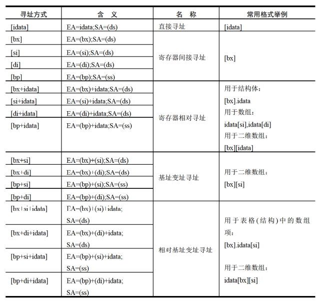
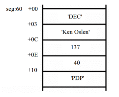

# 数据处理的两个基本问题

计算机是进行数据处理、`运算的机器，那么有两个基本的问题就包含在其中:
- 处理的数据在什么地方
- 要处理的数据有多长

这两个问题，在机器指令中必须给以明确或隐含的说明，否则计算机就无法工作。

定义描述性符号: `reg` 和 `sreg`。`reg` 表示一个寄存器，`sreg` 表示一个段寄存器。

- `reg` 的集合包括：`ax`、`bx`、`cx`、`dx`、`ah`、`al`、`bh`、`bl`、`ch`、`cl`、`dh`、`dl`、`sp`、`bp`、`si`、`di`
- `sreg` 的集合包括：`ds`、`ss`、`cs`、`es`

## `bx`、`si`、`di` 和 `bp`

- 只有该四个寄存器可以在 `[...]` 内进行内存单元寻址:

  ```asm
  mov ax,[bx]
  mov ax,[bx+si]
  mov ax,[bx+di]
  mov ax,[bp]
  mov ax,[bp+si]
  mov ax,[bp+di]
  ```

  而下面的指令是错误的:

  ```asm
  mov ax,[cx]
  mov ax,[ax]
  mov ax,[dx]
  mov ax,[ds]
  ```

- 在 `[...]` 中，这 `4` 个寄存器可以单个出现，或只能以 `4` 种组合出现: `bx 和 si`、`bx 和 di`、`bp 和 si`、`bp 和 di`:

  ```asm
  mov ax,[bx]
  mov ax,[si]
  mov ax,[di]
  mov ax,[bp]
  mov ax,[bx+si]
  mov ax,[bx+di]
  mov ax,[bp+si]
  mov ax,[bp+di]
  mov ax,[bx+si+idata]
  mov ax,[bx+di+idata]
  mov ax,[bp+si+idata]
  mov ax,[bp+di+idata]
  ```

  下面的指令是错误的:

  ```asm
  mov ax,[bx+bp]
  mov ax,[si+di]
  ```

- 只要在 `[...]` 中使用寄存器 `bp`，而指令中没有显性地给出段地址，段地址就默认在 `ss` 中:

  ```asm
  mov ax,[bp] ; 含义: (ax)=((ss)*16+(bp))
  mov ax,[bp+idata] ; 含义: (ax)=((ss)*16+(bp)+idata)
  mov ax,[bp+si] ; 含义: (ax)=((ss)*16+(bp)+(si))
  mov ax,[bp+si+idata] ; 含义: (ax) =((ss)*16+(bp)+(si)+idata)
  ```

## 机器指令处理的数据在什么地方

绝大部分机器指令都是进行数据处理的指令，处理大致可分为 `3` 类：读取、写入、运算。在机器指令这一层来讲，并不关心数据的值是多少，而关心指令执行前一刻，它将要处理的数据所在的位置。指令在执行前，所要处理的数据可以在 `3` 个地方: `CPU` 内部、内存、端口:

|机器码|汇编指令|指令执行前数据的位置|
|-|-|
|`8E1E0000`|`mov bx,[0]`|内存，`ds:0` 单元|
|`89C3`|`mov bx,ax`|`CPU` 内部，`ax` 寄存器|
|`BB0100`|`mov bx,1`|`CPU` 内部，指令缓冲器|

## 汇编语言中数据位置的表达

汇编语言中用 `3` 个概念来表达数据的位置。

- 立即数 `idata`
  - 对于直接包含在机器指令中的数据（执行前在 `CPU` 的指令缓冲器中），在汇编语言中称为: 立即数（`idata`），在汇编指令中直接给出
  - 例:
    ```asm
    mov ax,1
    add bx,2000h
    or bx,00010000b
    mov al,'a'
    ```
- 寄存器
  - 指令要处理的数据在寄存器中，在汇编指令中给出相应的寄存器名
  - 例:
    ```asm
    mov ax,bx
    mov ds,ax
    push bx
    mov ds:[0],bx
    push ds
    mov ss,ax
    mov sp,ax
    ```
- 段地址（`SA`）和偏移地址（`EA`）
  - 指令要处理的数据在内存中，在汇编指令中可用 `[X]` 的格式给出 `EA`，`SA` 在某个段寄存器中
  - 存放段地址的寄存器可以是默认的，比如:
    ```asm
    mov ax,[0]
    mov ax,[di]
    mov ax,[bx+8]
    mov ax,[bx+si]
    mov ax,[bx+si+8]
    ```
    等指令，段地址默认在 `ds` 中
    ```asm
    mov ax,[bp]
    mov ax,[bp+8]
    mov ax,[bp+si]
    mov ax,[bp+si+8]
    ```
    等指令，段地址默认在 `ss` 中。

    存放段地址的寄存器也可以是显性给出的，比如以下的指令
    ```asm
    mov ax,ds:[bp] ; 含义: (ax)=((ds)*16+(bp))
    mov ax,es:[bx] ; 含义: (ax)=((es)*16+(bx))
    mov ax,ss:[bx+si] ; 含义: (ax)=((ss)*16+(bx)+(si))
    mov ax,cs:[bx+si+8] ; 含义: (ax)=((cs)*16+(bx)+(si)+8)
    ```

## 寻址方式

当数据存放在内存中的时候，我们可以用多种方式来给定这个内存单元的偏移地址，这种定位内存单元的方法一般被称为寻址方式:



## 指令要处理的数据有多长

`8086CPU` 的指令可以处理两种尺寸的数据，`byte` 和 `word`。所以在机器指令中要指明，指令进行的是字操作还是字节操作。

对于这个问题，汇编语言中用以下方法处理:
- 通过寄存器名指明要处理的数据的尺寸:
  - 下面的指令中，寄存器指明了指令进行的是字操作:
    ```asm
    mov ax,1
    mov bx,ds:[0]
    mov ds,ax
    mov ds:[0],ax
    inc ax
    add ax,1000
    ```
  - 下面的指令中，寄存器指明了指令进行的是字节操作:
    ```asm
    mov al,1
    mov al,bl
    mov al,ds:[0]
    mov ds:[0],al
    inc al
    add al,100
    ```
- 在没有寄存器名存在的情况下，用操作符 `X ptr` 指明内存单元的长度，`X` 在汇编指令中可以为 `word` 或 `byte`:
  - 下面的指令中，用 word ptr 指明了指令访问的内存单元是一个字单元:
    ```asm
    mov word ptr ds:[0],1
    inc word ptr [bx]
    inc word ptr ds:[0]
    add word ptr [bx],2
    ```
  - 下面的指令中，用 byte ptr 指明了指令访问的内存单元是一个字节单元:
    ```asm
    mov byte ptr ds:[0],1
    inc byte ptr [bx]
    inc byte ptr ds:[0]
    add byte ptr [bx],2
    ```

  在没有寄存器参与的内存单元访问指令中，用 `word ptr` 或 `byte ptr` 显性地指明所要访问的内存单元的长度是很必要的。否则，`CPU` 无法得知所要访问的单元是字单元，还是字节单元。

  假设，用 `Debug` 查看内存结果如下:

  ```
  2000:1000 FF FF FF FF FF FF....
  ```

  那么指令:

  ```asm
  mov ax,2000H
  mov ds,ax
  mov byte ptr [1000H],1
  ```

  将使内存中的内容变为:

  ```
  2000:100001FFFFFFFFFF.....
  ```

  而指令:

  ```asm
  mov ax,2000H
  mov ds,ax
  mov word ptr [1000H],1
  ```

  将使内存中的内容变为:

  ```
  2000:1000 01 00 FF FF FF FF......
  ```

  这是因为 `mov byte ptr [1000H],1` 访问的是地址为 `ds:1000H` 的字节单元，修改的是 `ds:1000H` 单元的内容，而 `mov word ptr [1000H],1 `访问的是地址为 `ds:1000H` 的字单元，修改的是 `ds:1000H` 和 `ds:1001H` 两个单元的内容。

- 其他方法
  - 有些指令默认了访问的是字单元还是字节单元，比如，`push[1000H]` 就不用指明访问的是字单元还是字节单元，因为 `push` 指令只进行字操作。

## 寻址方式的综合应用

假设:

关于 `DEC` 公司的一条记录如下:

```
公司名称: DEC
总裁姓名: Ken Olsen
排名:137
收入: 40(40亿美元)
著名产品: PDP(小型机)
```



这些数据被存放在 `seg` 段中从偏移地址 `60H` 起始的位置，从 `seg:60` 起始以 `ASCII` 字符的形式存储了 `3` 个字节的公司名称，从 `seg:60+3` 起始以 `ASCII` 字符的形式存储了 `9` 个字节的总裁姓名，从 `seg:60+0C` 起始存放了一个字型数据，总裁在富翁榜上的排名，从 `seg:60+0E` 起始存放了一个字型数据，公司的收入，从 `seg:60+10` 起始以 `ASCII` 字符的形式存储了 `3` 个字节的产品名称。

但是到了 `1988` 年 `DEC` 的公司的信息有了如下的变化:
- `Ken Olsen` 在富豪榜上的排名已经上升到 `38` 位
- `DEC` 的收入增加了 `70` 亿美元
- 该公司的著名的产品已经变成了 `VAX` 系列的计算机

于是我们写出下面的简单的代码:

```asm
mov ax,seg
mov ds,ax
mov bx,60h ; 确定记录地址，ds:bx

mov word ptr [bx+0ch],38 ; 排名字段改为 38
add word ptr [bx+0eh],70 ; 收入字段增加 70

mov si,0 ; 用 si 来定位产品字符串中的字符
mov byte ptr [bx+10h+si],'V'
inc si
mov byte ptr [bx+10h+si],'A'
inc si
mov byte ptr [bx+10h+si],'X'
```

可以用 `C` 语言来描述这个程序，大致应该是这样的:

```cpp
struct company{ // 定义一个公司记录的结构体
    char cn[3]; // 公司名称
    char hn[9]; // 总裁姓名
    int pm; // 排名
    int sr; // 收入
    char cp[3]; // 著名产品
};

main() {
    int i;
    dec.pm = 38;
    dec.sr = dec.sr+70;
    i = 0;
    dec.cp[i] = 'V';
    i = 1;
    dec.cp[i] = 'A';
    i = 2;
    dec.cp[i] = 'X';
    return 0;
}
```

再按照 `C` 语言的风格，用汇编语言写一下这个程序:

```asm
mov ax,seg
mov ds,ax
mov bx,60h ; 记录首址送 BX
mov word ptr [bx].0ch,38 ; 排名字段改为 38
												 ; C: dec.pm = 38;
add word ptr [bx].0ech,70 ; 收入字段增加 70
													; C: dec.sr = dec.sr + 70;
													; 产品字段改为字符串 'VAX'
mov si,0									; C: i = 0;
mov byte ptr [bx].10h[si],'V' ; dec.cp[i] = 'V';
inc si												; i++;
mov byte ptr [bx].10h[si],'A' ; dec.cp[i] = 'A';
inc si												; i++;
mov byte ptr [bx].10h[si],'X' ; dec.cp[i] = 'X';
inc si												; i++;

```

`8086CPU` 提供的如 `[bx+si+idata]` 的寻址方式为结构化数据的处理提供了方便。使得我们可以在编程的时候，从结构化的角度去看待所要处理的数据。

从上面可以看到，一个结构化的数据包含了多个数据项，而数据项的类型又不相同，有的是字型数据，有的是字节型数据，有的是数组。一般来说，我们可以用 `[bx+idata+si]` 的方式来访问结构体中的数据。用 `bx` 定位整个结构体，用 `idata` 定位结构体中的某一个数据项，用 `si` 定位数组项中的每个元素。为此，汇编语言提供了更为贴切的书写方式，如:

```asm
[bx].idata
[bx].idata[si]
```

## `div` 指令

`div` 是除法指令，需要注意的如下:
- 除数: 有 `8` 位和 `16` 位两种，在一个 `reg` 或内存单元中
- 被除数: 默认放在 `AX` 或 `DX` 和 `AX` 中，如果除数为 `8` 位，被除数则为 `16` 位，默认在 `AX` 中存放；如果除数为 `16` 位，被除数则为 `32` 位，在 `DX` 和 `AX` 中存放，`DX` 存放高 `16` 位，`AX` 存放低 `16` 位
- 结果: 如果除数为 `8` 位，则 `AL` 存储除法操作的商，`AH` 存储除法操作的余数，如果除数为 `16` 位，则 `AX` 存储除法操作的商，`DX` 存储除法操作的余数

格式如下:

```
div reg
div 内存单元
```

例如:

```asm
div byte ptr ds:[0]
; 含义: (al)=(ax)/((ds)*16+0)的商
; (ah)=(ax)/((ds)*16+0)的余数
div word ptr es:[0]
; 含义: (ax)=[(dx)*10000H+(ax)]/((es)*16+0)的商
; (dx)=[(dx)*10000H+(ax)]/((es)*16+0)的余数
div byte ptr [bx+si+8]
; 含义: (al)=(ax)/((ds)*16+(bx)+(si)+8)的商
; (ah)=(ax)/((ds)*16+(bx)+(si)+8)的余数
div word ptr [bx+si+8]
; 含义: (ax)=[(dx)*10000H+(ax)]/((ds)*16+(bx)+(si)+8)的商
; (dx)=[(dx)*10000H+(ax)l/((ds)*16+(bx)+(si)+8)的余数
```

利用除法指令计算 `100001/100`:

首先被除数 `100001` 大于 `65535`，不能用 `ax` 寄存器存放，所以只能用 `dx` 和 `ax` 两个寄存器联合存放 `100001`，也就是说要进行 `16` 位的除法。除数 `100` 小于 `255`，可以在一个 `8` 位寄存器中存放，但是，因为被除数是 `32` 位的，除数应为 `16` 位，所以要用一个 `16` 位寄存器来存放除数 `100`。

因为要分别为 dx 和 ax 赋 100001 的高 16 位值和低 16 位值，所以应先将 `100001` 表示为 `16` 进制形式: `186A1H`。

```asm
mov dx,1
mov ax,86A1H ; (dx)*10000H+(ax)=100001
mov bx,100
div bx
```

程序执行后，`(ax)=03E8H`，`(dx)=1`。

编程，利用除法指令计算 `1001/100`:

首先被除数 `1001` 可用 `ax` 寄存器存放，除数 `100` 可用 `8` 位寄存器存放，也就是说，要进行 `8` 位的除法。

```asm
mov ax,1001
mov bl,100
div bl
```

程序执行后，`(al)=0AH`，`(ah)=1`。

## 伪指令 `dd`

前面我们用 `db` 和 `dw` 定义字节型数据和字型数据。`dd` 是用来定义 `dword`（`double word`，双字）型数据的。比如:

```asm
data segment
db 1
dw 1
dd 1
data ends
```

在 `data` 段中定义了 `3` 个数据:
- 第一个数据为 `01H`，在 `data:0` 处，占 `1` 个字节
- 第二个数据为 `0001H`，在 `data:1` 处，占 `1` 个字
- 第三个数据为 `00000001H`，在 `data:3` 处，占 `2` 个字

## `dup`

`dup` 是一个操作符，在汇编语言中同 `db`、`dw`、`dd` 等一样，也是由编译器识别处理的符号。它是和 `db`、`dw`、`dd` 等数据定义伪指令配合使用的，用来进行数据的重复。比如:

```asm
db 3 dup (0)
```

定义了 `3` 个字节，它们的值都是 `0`，相当于 `db 0,0,0`。

```asm
db 3 dup (0,1,2)
```

定义了 `9` 个字节，它们是 `0`、`1`、`2`、`0`、`1`、`2`、`0`、`1`、`2`,相当于 `db 0,1,2,0,1,2,0,1,2`。

```asm
db 3 dup ('abc','ABC')
```

定义了 `18` 个字节，它们是 `abcABCabcABCabcABC`，相当于 `db 'abcABCabcABCabcABC'`。

`dup` 的使用格式如下:
- `db` 重复的次数 `dup` (重复的字节型数据)
- `dw` 重复的次数 `dup` (重复的字型数据)
- `dd` 重复的次数 `dup` (重复的双字型数据)

dup 是一个十分有用的操作符，比如要定义一个容量为 200 个字节的栈段，如果不用 dup，则必须:

```asm
stack segment
  dw 0,0,0,0,0,0,0,0,0,0,0,0,0,0,0,0,0,0,0,0
  dw 0,0,0,0,0,0,0,0,0,0,0,0,0,0,0,0,0,0,0,0
  dw 0,0,0,0,0,0,0,0,0,0,0,0,0,0,0,0,0,0,0,0
  dw 0,0,0,0,0,0,0,0,0,0,0,0,0,0,0,0,0,0,0,0
  dw 0,0,0,0,0,0,0,0,0,0,0,0,0,0,0,0,0,0,0,0
stack ends
```

用 `dd` 使程序变得简短一些，但是如果要求定义一个容量为 `1000` 字节或 `10000` 字节，如果没有 `dup`，定义部分的程序就变得太长了:

```asm
stack segment
  db 200 dup (0)
stack ends
```