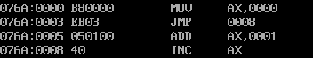
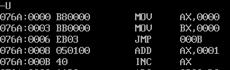
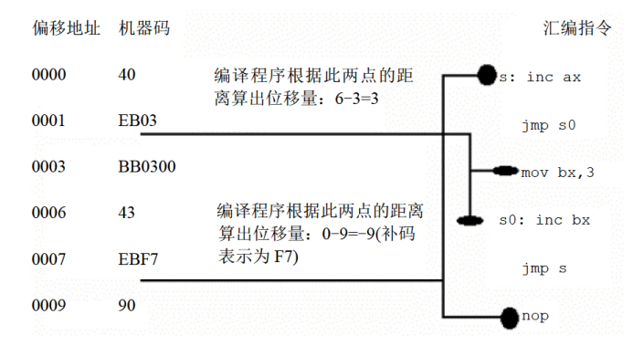
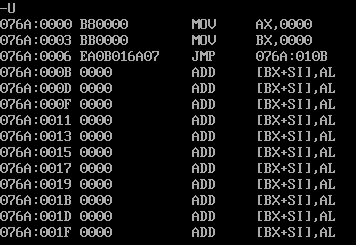

# 转移指令的原理

可以修改 `IP`，或同时修改 `CS` 和 `IP` 的指令统称为转移指令。概括地讲，转移指令就是可以控制 `CPU` 执行内存中某处代码的指令。

`8086CPU` 的转移行为有以下几类:
- 只修改 `IP` 时，称为段内转移，比如: `jmp ax`
- 同时修改 `CS` 和 `IP` 时，称为段间转移，比如: `jmp 1000:0`

由于转移指令对 `IP` 的修改范围不同，段内转移又分为: 短转移和近转移
- 短转移 `IP` 的修改范围为 `-128~127`
- 近转移 `IP` 的修改范围为 `-32768~32767`

`8086CPU` 的转移指令分为以下几类:
- 无条件转移指令（如: `jmp`）
- 条件转移指令
- 循环指令（如: `loop`）
- 过程
- 中断

这些转移指令转移的前提条件可能不同，但转移的基本原理是相同的。

## 操作符 `offset`

操作符 `offset` 在汇编语言中是由编译器处理的符号，它的功能是取得标号的偏移地址。比如下面的程序:

```asm
assume cs:codesg
codesg segment
start:
    mov ax,offset start ; 相当于 mov ax,0
s:
    mov ax,offset s ; 相当于 mov ax,3
codesg ends
end start
```

在上面的程序中，`offset` 操作符取得了标号 `start` 和 `s` 的偏移地址 `0` 和 `3`，所以指令:
- `mov ax,offset start` 相当于指令 `mov ax,0`，因为 `start` 是代码段中的标号，它所标记的指令是代码段中的第一条指令，偏移地址为 `0`
- `mov ax,offset s` 相当于指令 `mov ax,3`，因为 `s` 是代码段中的标号，它所标记的指令是代码段中的第二条指令，第一条指令长度为 `3` 个字节，则 `s` 的偏移地址为 `3`

## `jmp` 指令

`jmp` 为无条件转移指令，可以只修改 `IP`，也可以同时修改 `CS` 和 `IP`。

`jmp` 指令要给出两种信息:
- 转移的目的地址
- 转移的距离（段间转移、段内短转移、段内近转移）

不同的给出目的地址的方法，和不同的转移位置，对应有不同格式的 `jmp` 指令。

## 依据位移进行转移的 `jmp` 指令

`jmp short 标号`（转到标号处执行指令）

这种格式的 `jmp` 指令实现的是段内短转移，它对 `IP` 的修改范围为 `-128~127`，也就是说，它向前转移时可以最多越过 `128` 个字节，向后转移可以最多越过 `127` 个字节。`jmp` 指令中的 `short` 符号，说明指令进行的是短转移。`jmp` 指令中的 `标号` 是代码段中的标号，指明了指令要转移的目的地，转移指令结束后，`CS:IP` 应该指向标号处的指令:

```asm
assume cs:codesg
codesg segment
start:
    mov ax,0
    jmp short s
    add ax,1
s:
    inc ax
codesg ends
end start
```

上面的程序执行后，`ax` 中的值为 `1`，因为执行 `jmp short s` 后，越过了 `add ax,1`，`IP` 指向了标号 `s` 处的 `inc ax`。也就是说，程序只进行了一次 `ax` 加 `1` 操作。

|汇编指令|机器指令|
|-|-|
|`mov ax,0123h`|`B8 23 01`|
|`mov ax,ds:[0123h]`|`A1 23 01`|
|`push ds:[0123h]`|`FF 36 23 01`|

可以看到，在一般的汇编指令中，汇编指令中的 `idata`，不论它是表示一个数据还是内存单元的偏移地址，都会在对应的机器指令中出现，因为 `CPU` 执行的是机器指令，它必须要处理这些数据或地址。

在 `Debug` 中将程序翻译成为机器码:



对照汇编源程序，可以看到，`Debug` 将 `jmp short s` 中的 `s` 表示为 `inc ax` 指令的偏移地址 `8`，并将 `jmp short s` 表示为 `jmp 0008`，表示转移到 `cs:0008` 处。

查看 `jmp short s` 或是 `jmp 0008` 所对应的机器码，却发现了一些问题:

`jmp 0008`（`Debug` 中的表示）或 `jmp short s`（汇编语言中的表示）所对应的机器码为 `EB 03`，注意，这个机器码中竟不包含转移的目的地址，这意味着，`CPU` 在执行 `EB 03` 时，并不知道转移的目的地址。

那么，`CPU` 根据什么进行转移呢？它知道转移到哪里呢？

汇编指令 `jmp short s` 中，明明是带有转移的目的地址（由标号 `s` 表示）的，可翻译成机器指令后，怎么目的地址就没了呢？

把程序改写一下，变成下面这样:

```asm
assume cs:codesg
codesg segment
start:
    mov ax,0
    mov bx,0
    jmp short s
    add ax,1
s:
    inc ax
codesg ends
end start
```



一个程序的 `inc ax` 指令的偏移地址为 `8`，而另一个程序的 `inc ax` 指令的偏移地址为 `000BH`，`jmp` 指令所对应的机器码都是 `EB 03`。

说明 `CPU` 在执行 `jmp` 指令的时候并不需要转移的目的地址。两个程序中的 `jmp` 指令的转移目的地址并不一样，如果机器指令中包含了转移
的目的地址的话，那么它们对应的机器码应该是不同的。可是它们对应的机器码都是 `EB 03`，这说明在机器指令中并不包含转移的目的地址。也就是说，`CPU` 不需要这个目的地址就可以实现对 `IP` 的修改。

在 `jmp` 指令的机器码中，一定包含了某种信息，使得 `CPU` 可以将它当做修改 `IP` 的依据。

`CPU` 执行指令的过程:
- 从 `CS:IP` 指向内存单元读取指令，读取的指令进入指令缓冲器
- `(IP)=(IP)+所读取指令的长度`，从而指向下一条指令
- 执行指令。转到 `1`，重复这个过程

按照这个步骤，看看程序中 `jmp short s` 指令的读取和执行过程:
- `(CS)=076AH`，`(IP)=0006H`，`CS:IP` 指向 `EB03`（`jmp short s` 的机器码）
- 读取指令码 `EB 03` 进入指令缓冲器
- `(IP)=(IP)+所读取指令的长度=(IP)+2=0008H`，`CS:IP` 指向 `add ax,1`
- `CPU` 执行指令缓冲器中的指令 `EB 03`
- 指令 `EB 03` 执行后，`(IP)=000BH`，`CS:IP` 指向 `inc ax`

从上面的过程中看到，`CPU` 将指令 `EB 03` 读入后，`IP` 指向了下一条指令，即 `CS:0008` 处的 `add ax,1`，接着执行 `EB 03`。如果 `EB 03` 没有对 `IP` 进行修改的话，那么，接下来 `CPU` 将执行 `add ax,1`，可是，`CPU` 执行的 `EB 03` 却是一条修改 `IP` 的转移指令，执行后 `(IP)=000BH`，`CS:IP `指向 `inc ax`，`CS:0008` 处的 `add ax,1` 没有被执行。

`CPU` 在执行 `EB 03` 的时候就是根据指令码中的 `03`。注意，要转移的目的地址是 `CS:000B`，而 `CPU` 执行 `EB 03` 时，当前的 `(IP)=0008H`，如果将当前的 `IP` 值加 `3`，使 `(IP)=000BH`，`CS:IP` 就可指向目标指令。

在转移指令 `EB 03` 中并没有告诉 `CPU` 要转移的目的地址，却告诉了 `CPU` 要转移的位移，即将当前的 `IP` 向后移动 `3` 个字节。因为程序中的 `jmp` 指令转移的位移相同，都是向后 `3` 个字节，所以它们的机器码都是 `EB 03`。

在 `jmp short 标号` 指令所对应的机器码中，并不包含转移的目的地址，而包含的是转移的位移。这个位移，是编译器根据汇编指令中的 `标号` 计算出来
的:



实际上，`jmp short 标号` 的功能为: `(IP)=(IP)+8位位移`
- `8位位移=标号处的地址-jmp指令后的第一个字节的地址`
- `short` 指明此处的位移为 `8位位移`
- `8位位移` 的范围为 `-128~127`，用补码表示
- `8位位移` 由编译程序在编译时算出

还有一种和 `jmp short 标号` 功能相近的指令格式，`jmp near ptr 标号`，它实现的是段内近转移:
- `jmp near ptr 标号` 的功能为: `(IP)=(IP)+16位位移`
- `16位位移=标号处的地址-jmp指令后的第一个字节的地址`
- `near ptr` 指明此处的位移为 `16位位移`，进行的是段内近转移
- `16位位移` 的范围为 `-32768~32767`，用补码表示
- `16位位移` 由编译程序在编译时算出

## 转移的目的地址在指令中的 `jmp` 指令

前面讲的 `jmp` 指令，其对应的机器指令中并没有转移的目的地址，而是相对于当前 `IP` 的转移位移。

`jmp far ptr 标号` 实现的是段间转移，又称为远转移。功能如下:

`(CS)=标号所在段的段地址`、`(IP)=标号在段中的偏移地址`。

`far ptr` 指明了指令用标号的段地址和偏移地址修改 `CS` 和 `IP`。

```asm
assume cs:codesg
codesg segment
start:
    mov ax,0
    mov bx,0
    jmp far ptr s
    db 256 dup (0)
s:
    add ax,1
    inc ax
codesg ends
end start

```



源程序中的 `db 256 dup (0)`，被 `Debug` 解释为相应的若干条汇编指令。注意 `jmp far ptr s` 所对应的机器码: `EA 0B 01 6A 07`，其中包含转移的目的地址。`0B 01 6A 07` 是目的地址在指令中的存储顺序，高地
址的 `6A 07` 是转移的段地址: `076AH`，低地址的 `0B 01` 是偏移地址: `010BH`。

## 转移地址在寄存器中的 `jmp` 指令

- 指令格式: `jmp 16位reg`
- 功能: `(IP)=(16位reg)`

## 转移地址在内存中的 `jmp` 指令

转移地址在内存中的 `jmp` 指令有两种格式:
- `jmp word ptr 内存单元地址`（段内转移）
  - 功能: 从内存单元地址处开始存放着一个字，是转移的目的偏移地址
  - 内存单元地址可用寻址方式的任一格式给出
  - 例如:
    ```asm
    mov ax,0123H
    mov ds:[0],ax
    jmp word ptr ds:[0]
    ```
  - 执行后，`(IP)=0123H`
  - 又例如:
    ```asm
    mov ax,0123H
    mov [bx],ax
    jmp word ptr [bx]
    ```
  - 执行后，`(IP)=0123H`

- `jmp dword ptr` 内存单元地址（段间转移）
  - 功能: 从内存单元地址处开始存放着两个字，高地址处的字是转移的目的段地址，低地址处是转移的目的偏移地址
  - `(CS)=(内存单元地址+2)`
  - `(IP)-(内存单元地址)`
  - 内存单元地址可用寻址方式的任一格式给出
  - 例如:
    ```asm
    mov ax,0123H
    mov ds:[0],ax
    mov word ptr ds:[2],0
    jmp dword ptr ds:[0]
    ```
  - 执行后，`(CS)=0`，`(IP)=0123H`，`CS:IP` 指向 `0000:0123`

  - 又例如:
    ```asm
    mov ax,0123H
    mov [bx],ax
    mov word ptr [bx+2],0
    jmp dword ptr [bx]
    ```
  - 执行后，`(CS)=0`，`(IP)=0123H`，`CS:IP` 指向 `0000:0123`

## `jcxz` 指令

`jcxz` 指令为有条件转移指令，所有的有条件转移指令都是短转移，在对应的机器码中包含转移的位移，而不是目的地址。对 `IP` 的修改范围都为: `-128~127`。

- 指令格式: `jcxz` 标号，如果 `(cx)=0`，转移到标号处执行
- 操作: 当 `(cx)=0` 时，`(IP)=(IP)+8位位移`
- `8位位移=标号处的地址-jcxz指令` 后的第一个字节的地址
- `8位位移` 的范围为 `-128~127`，用补码表示
- `8位位移` 由编译程序在编译时算出
- 当 `(cx)!=0` 时，什么也不做

`jcxz 标号` 的功能相当于:

```cpp
if ((cx)==0) jmp short 标号;
```

## `loop` 指令

`loop` 指令为循环指令，所有的循环指令都是短转移，在对应的机器码中包含转移的位移，而不是目的地址。对 `IP` 的修改范围都为: `-128~127`。

- 指令格式: `loop 标号`，`(cx)=(cx)-1`，如果 `(cx)!=0`，转移到标号处执行
- 操作:
  - `(cx)=(cx)-1`
  - 如果 `(cx)=0`，`(IP)=(IP)+8` 位位移。
- `8位位移=标号处的地址-loop指令` 后的第一个字节的地址
- `8位位移` 的范围为 `-128~127`，用补码表示
- `8位位移` 由编译程序在编译时算出
- 如果 `(cx)=0`，什么也不做

`loop 标号` 的功能相当于:

```cpp
(cx)--;
if ((cx) != 0) jmp short 标号;
```

## 根据位移进行转移的意义

```asm
jmp short 标号
jmp near ptr 标号
jcxz 标号
loop 标号
```

这几种汇编指令，它们对 `IP` 的修改是根据转移目的地址和转移起始地址之间的位移来进行的。在它们对应的机器码中不包含转移的目的地址，而包含的是到目的地址的位移。

这种设计，方便了程序段在内存中的浮动装配。例如:

|汇编指令|机器代码|
|-|-|
|`mov cx,6`|`B9 06 00`|
|`mov ax,10h`|`B8 10 00`|
|`s: add ax,ax`|`01 C0`|
|`loop s`|`E2 FC`|

这段程序装在内存中的不同位置都可正确执行，因为 `loop s` 在执行时只涉及 `s` 的位移（`-4`，前移 `4` 个字节，补码表示为 `FCH`），而不是 `s` 的地址。如果 `loop s` 的机器码中包含的是 `s` 的地址，则就对程序段在内存中的偏移地址有了严格的限制，因为机器码中包含的是 `s` 的地址，如果 `s` 处的指令不在目的地址处，程序的执行就会出错。而 `loop s` 的机器码中包含的是转移的位移，就不存在这个问题了，因为，无论 `s` 处的指令的实际地址是多少，`loop` 指令的转移位移是不变的。

## 编译器对转移位移超界的检测

根据位移进行转移的指令，它们的转移范围受到转移位移的限制，如果在源程序中出现了转移范围超界的问题，在编译的时候，编译器将报错。比如:

```asm
assume cs:code
code segment
start:
    jmp short s
    db 128 dup (0)
s:
    mov ax,0ffffh
code ends
end start
```

`jmp short s` 的转移范围是 `-128~127`，`IP` 最多向后移动 `127` 个字节。

注意，形如 `jmp 2000:0100` 的转移指令，是在 `Debug` 中使用的汇编指令，汇编编译器并不认识。如果在源程序中使用，编译时也会报错。